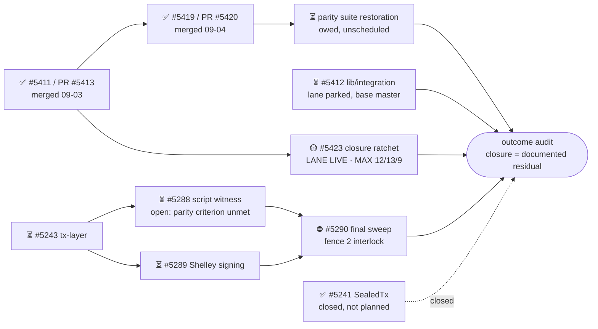

# M1 — Drop cardano-api — state

Outcome: no production library under `lib/` depends on `cardano-api`, verified
in the dependency closure, with transaction bytes and database compatibility
preserved.
Updated: 2026-09-04

Legend: ✅ done · 🟡 active/next · ⏳ queued · ⛔ blocked · ❓ unknown

## The criterion, measured — not asserted

Two counters, both re-measured at `master` = `6b42c36b58` on 2026-09-04.
These are the numbers the commissioned ratchet freezes as `MAX`.

| row | measures | value | licenses |
|---|---|---|---|
| **closure-lib** | `lib/*` packages whose **library** transitively reaches `cardano-api` | **12** | **this milestone's completion criterion.** 0 ⇒ `m1-closure` satisfied |
| **closure-any** | `lib/*` packages reaching `cardano-api` through **any** stanza | **13** | **not a completion criterion.** 0 ⇒ the pin can leave `cabal.project`. Owned by whoever removes the pin |
| **suppressions** | deprecation pragmas, both spellings, `*.hs` / `*.cabal` / `cabal.project*` | **9** | no new suppression lands unobserved |

The suppression counter moved for the first time this milestone: **12 → 9**. The
closure counter has **not moved at all** since the milestone opened, and that is
the honest reading — the deprecation work retires *warnings*; only a package
leaving the closure moves the outcome.

**`closure-lib` was 9 until 2026-09-04 and that number was wrong.** It counted
**direct** `build-depends` edges while the contract's subject is the closure.
Four packages were already transitive-only, so a direct-edge counter would have
**reached zero while the closure was non-empty**. `MAX` 9 → 12 is an instrument
correction, not a raise: the world did not change, the population did.

**Why two closure rows.** `closure-lib` = 0 can be *true of the milestone and
false of the repository*: `cardano-wallet-benchmarks` names `cardano-api` in
`benchmark db` and `benchmark api`, so the pin stays in `cabal.project` even when
every production library is clean. One row would either overstate (blocking M1
on work that is not M1's) or understate (reporting done while the dependency is
still built). Two rows, each labelled with what it licenses.
## Order of work — **order only, no schedule**

No unit in this milestone has an estimate. Nothing below has a bar width,
because a bar width would invent a schedule.

## Units

| unit | state | note |
|---|---|---|
| **closure ratchet — #5423** | 🟡 **FILED, LANE LIVE** — `%441` T.O. / `%443` commit owner / `%442` auditor | three rows in one gate, `MAX` 12 / 13 / 9 re-measured at `6b42c36b58`, base `master`. Scoped **by form**, so the growing `specs/` tree cannot trip it. Negative control per row, in CI. Additions exit 1; slack is advisory and **stated**, not inherited |
| #5411 / PR **#5413** | ✅ **MERGED** 2026-09-03, merge commit `1fdc2d8b41` | `mkUnsignedTx` now returns `Write.Tx era`; both consumers read the ledger transaction directly |
| #5419 / PR **#5420** | ✅ **MERGED** 2026-09-04, merge commit `6b42c36b58` = current `master` | audit still **owed** — no auditor was ever seated on that campaign |
| #5412 `lib/integration` suppression | ⏳ **lane parked**, `base=master`, independent of everything | likely terminus named in advance: no ledger-native path for a legacy Alonzo body → escalate, do not design. Re-task decision below |
| **parity suite restoration** | ⏳ **owed, unscheduled** | `buildLegacyParityTx` still ends `in body`; the three populated script-witness cases compare a builder against itself and stay green either way |
| #5237 parent epic | ⏳ queued | unassigned |
| #5243 tx-layer | ⏳ queued | unassigned |
| #5288 script witness | ⏳ **legitimately OPEN — settled** | `088de979f0` is merged, but **criterion 3 is unmet**: `buildLegacyParityTx` still ends `in body`, and since #5413 `mkUnsignedTx` returns `Write.Tx`, so the parity comparison no longer spans `cardano-api`. Closing that gap closes the issue (`U-11`) |
| #5289 Shelley signing | ⏳ queued | "follows #5285" is historical — #5285 is closed |
| #5241 SealedTx | ✅ **CLOSED** as not planned | ruling executed. `SealedTx` is already `EraValue Read.Tx` |
| #5290 final sweep | ⛔ blocked | fence 2 — needs a ruling naming M6's state. Also owns retiring `Gen.hs`'s suppression |

## Blockers, each with what unblocks it

| blocker | unblocked by |
|---|---|
| ~~ratchet not filed~~ | **RESOLVED** — cleared with *"make it a PR"*; #5423 filed and the lane is live |
| **#5420 audit owed** | **trigger set** — `%441`'s submission reaching its auditor. Seat it as an audit of **shipped** code; that changes what a finding means |
| **fence 2** on `Cardano/Api/Extra.hs` | a project-owner ruling naming M6's state at that moment |
| ~~#5288 may be redundant~~ | **RESOLVED** — it is not; criterion 3 is unmet. Trigger for the fix: #5423 merged |
| **milestone artifact** | a project-level ruling — M1 produces no forkable executable |
| ~~pause with no written release~~ | **RESOLVED** — `RELEASE-2026-09-04T1249Z-wallet.md`, hash verified before acting |

## Standing rulings

- **M6 implements the five `Cardano/Api/Extra.hs` stubs; M1 deletes them later.**
  Settled; neither desk reopens it. Four of the five sit on live production call
  paths, so sequencing M6 behind M1 would ship a wallet that throws on Dijkstra.
- **The census denominator is not narrowed to exclude `Extra.hs`.** The count
  falls by deletion or implementation, never by agreement between two desks.
- **A ratchet row at a nonzero target must ratchet the named set, not a count.**
  At a target of 0 a count *is* a set; at any nonzero target a count admits
  substitution silently.
- **Scope by structure, not by pattern.** A pattern-based instrument pointed at a
  document that discusses its own subject will match the discussion. Both rows
  are anchored by form, which is why the growing `specs/` population is free.
- **An audit run to unblock is not the artifact of an audit run to decide.**
- **No comments, pings, or review requests.** Addressed to people; the operator's
  to send. Drafts go to `handoffs/`.
