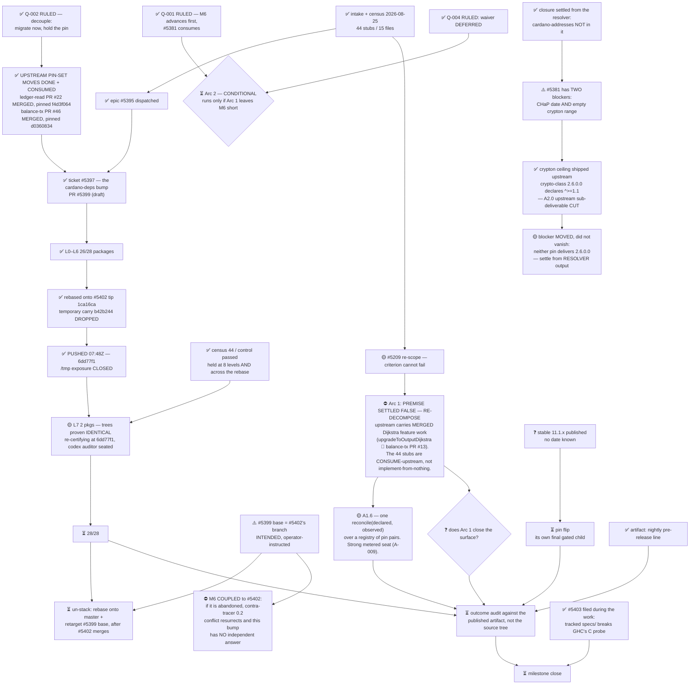

# M6 — Dijkstra HF readiness (#118) — state

Updated: 2026-09-01

Outcome: the wallet is READY for the Dijkstra hard fork — every era code path
implemented and exercised. The outcome is readiness, NOT a version number.

> ## ⏸ AWAITING GO-DARK — wallet lane, 2026-09-01
>
> `RULING-2026-09-01-wallet-5420-then-dark.md`, sha256 `090dfdbb…b4b5`,
> recomputed at this desk. The lane runs only until **#5420 is green and open**,
> then every wallet seat writes `PAUSED` with its head SHA. **`%4` is in the
> census.** Start nothing new. #5420 is M1's.
>
> **The current, measured disposition of everything this desk owns is
> `resume/disposition-going-dark.md`.** Where this page disagrees with it, that
> page is right — it was measured on 2026-09-01 and most of this one was not.

> ## What has changed since this page was last accurate
>
> | | |
> |---|---|
> | `#5402` | **MERGED** 2026-08-31 → `99c3a7e88b` |
> | `#5399` | **MERGED** 2026-09-01T15:08Z → `4a2227a725`, now `origin/master` |
> | `#5413` | OPEN, `REVIEW_REQUIRED`, head `f1dd799c` — **the only non-draft PR in the repo**, and the binding constraint on everything |
> | `#5419` | filed by this desk, **re-homed to M1 (#113)**, now delivered as **#5420** (draft) |
> | lanes `%310` `%304` | **released to M1** 2026-09-01; audit was owed and never run |
> | suppressions | master `7` → `12` across #5399; #5413 takes it to `11` |
> | release blockers | **#5408, #5416, #5409, #5417** — all four now stamped into #118 |


> ## ✅ RELEASED — wallet session only, 2026-08-27T07:53Z
>
> `/tmp/machine/pausa/RELEASE-2026-08-27T0753Z-wallet.md`, sha256
> `1d57606a91c04c0fba5ee1717d62e11a05e5788a397678988b45b3574ce97b85`
> (recomputed at this desk). Released by the machine owner on explicit operator
> instruction.
>
> **Scope is narrow and stays narrow.** This releases the `wallet` session
> alone. `OMNIA-PAUSA-2026-08-26T2014Z` **remains in force** for `cds-71`,
> `reactivegas`, `treasury-ms1` and session 0. Those sessions are not reachable;
> anything needed from them routes to the machine owner. Nothing here is relayed
> outside the wallet session.
>
> Parked 2026-08-26T20:14Z → released 2026-08-27T07:53Z. Both ends on the record.


## ⛔ The bump is NOT green — a false acceptance, and the gate never ran the check

The clean `--flags=release` (`-O2 -Werror`) build **failed**:

```
ScriptValidity.hs:35:29
  In the use of type constructor IsValid (imported from Cardano.Ledger.Alonzo.Tx):
  Deprecated: In favor of IsPhase2Valid
```

`lib/cardano-wallet-read` carries **no** suppression, so nothing masked it.
Commit `e7bec1d`, titled *"adapt cardano-wallet-read to 11.1.0 IsPhase2Valid
API"*, changed **import syntax only** — the module still has 7 `IsValid`
references and zero `IsPhase2Valid`. **That package was built, tested, audited
and ACCEPTED at L0.**

### The diagnosis is not "the gate was weak"

**The gate never ran the check.** A deprecation is a warning; it fails a build
only under `-Werror`; the acceptance gate never used `--flags=release`, which is
what enables `-O2 -Werror` here and what CI uses. So it **could not have caught
this class on any package, at any level, however rigorous the auditor.**
Compounding it, the epic's `-Wno-error` was rejected by GHC as unrecognised
**180 times, unread**.

> **A gate that does not run the flags CI runs is not a weak gate. It is a
> different gate, and its PASS says nothing about the question being asked.**

### Consequence — every acceptance is provisional

The same gate accepted **all 28 packages**, so every `L0`–`L7` acceptance is
**provisional** until the clean build completes. The next artefact is the
**complete failure list** (`--keep-going`, to completion) — **not** the first
fix. Reporting green off the first surfaced site would repeat the error that
produced this.

`L0`'s acceptance is **void for `cardano-wallet-read`** — it tested something
other than what was claimed. Other levels are **not** pre-emptively reopened;
the list decides, and guessing would be the same error in reverse.

Found, and disclosed immediately, **by the epic itself** — on its own branch,
after acceptance, against its own interest in landing a finished bump.

## ✅ Preservation risk — CLOSED

**The 21 commits are on a remote.** The epic owner force-pushed at **07:48Z** —
five minutes *before* the release order was written.

Re-derived from GitHub rather than relayed, and rather than trusted from a
remote-tracking ref:

| check | result |
|---|---|
| `git ls-remote` → `refs/heads/chore/issue-5397-node-11-1-0` | `6dd77f1a7dc5c35513cf33dac2da3536c2776b5e` |
| PR #5399 `headRefOid` (GitHub API) | the same |
| three sampled lane commits via API | all resolve |
| negative control: a `deadbeef` SHA | correctly `422` |

The 10-day `/tmp` exposure is closed. **The release order's own premise was
stale by five minutes** — it described `71f7c29`, PR head `027add45`, and 21
commits at risk. The tree had already moved. That is now twice that an order
arrived describing a tree that had changed, and the standing lesson is worth
keeping: **an order's state description is evidence about when it was written,
never about the tree now.**

## ⚠️ #5399 is a stacked PR — intended, and it couples M6 to another epic

PR #5399's base is **no longer `master`** — it is `chore/drop-iohk-monitoring`,
PR #5402's branch. Read from the API (`baseRefName`), not inferred.

**RULED by the project owner (`A-005`, 2026-08-27): the coupling is ACCEPTED, and it is NOT cross-milestone.** #5401 carried **no milestone at all** — the dependency existed only as a `baseRefName` on a draft PR, invisible to every desk. #5401 is now **stamped into M6 (#118)**, so this desk owns both epics and the sequencing; no project-level relief was needed or granted. The retarget itself was **INTENDED**, and the epic owner confirmed the provenance: the base was
retargeted on **direct operator instruction** ("on GH I want to see the correct
base"), not as a side effect of the rebase. Recorded as intended — together with
the consequence, which had not been written down anywhere: **#5399 cannot merge
until #5402 merges.** The epic owner took that criticism as its own: it made the
change and did not record what it implied, and an edge that exists only in one
agent's head is not recorded.

### The un-stacking is owed — named now, not discovered later

Once #5402 merges to `master`:

1. rebase `chore/issue-5397-node-11-1-0` onto `master`;
2. retarget #5399's base back to `master`;
3. the 16 commits should replay unchanged — #5402's content will be in `master`.

### ✅ The exposure is priced — risk is LOW, and the real blocker is a review

**If #5402 is abandoned or substantially reworked, #5399's base disappears** —
and re-planting on `master` **resurrects the `contra-tracer` 0.2 conflict**: an
**empty intersection** between `iohk-monitoring`'s `< 0.2` and node 11.1.0's
`== 0.2.1.1`. #5402 currently solves it for us by *deleting* the legacy stack.

**This bump has no independent answer to that conflict.**

**But the premise "#5402 abandoned or reworked" is not supported by evidence.**
The project owner read the review: `disassembler` **endorses the design**
(`contra-tracer` over `trace-dispatcher` is "the right call") and
**independently validates the exact property M6 depends on** — that the CPP
guard handles node 11.1.0's `>= 0.2.1.1`, "so the node bump in #5397 can
advance the pin without revisiting this module." A maintainer has confirmed
#5402 solves the conflict for us.

**RULED: do NOT scope an independent `contra-tracer` answer today.** "Cheap to
scope" is not free. Named triggers that reopen it, any one sufficient:
#5402 closed without merging; a second review round changing the tracing
**package boundary** (a third round of nits is not a trigger); or the
re-review request unanswered by **2026-09-03**.

**The actual blocker is neither code nor CI.** `disassembler` requested changes
at 2026-08-26T16:47:24Z; `mergeStateStatus` is **BLOCKED**;
`reviewDecision=CHANGES_REQUESTED`. The lane fixed all three items by 17:37Z
and never saw the human review — its 138-line journal never mentions it — so it
recorded itself "ready-for-review" while blocked. **Fixing what a review asked
for does not answer the review.** The owed reply and re-request are now the
cheapest item on the critical path for BOTH PRs.

Legend: ✅ done · 🟡 active/next · ⏳ queued · ⛔ blocked · ❓ unknown

## Where the milestone is

The dependency advance is **27 of 28 packages closed**. Eight levels `L0`→`L7`
ran in sublibrary topological order, one commit per sublibrary per
`cardano-deps`. Only `L7`'s two benchmark packages remain, they are **proven
no-change**, and a fresh codex auditor is seated on them.

Branch `chore/issue-5397-node-11-1-0` @ **`6dd77f1`** = the pushed remote head,
worktree clean, gate `PASS`, **16 lane commits** on base `1ca16ca`.

The binding operator invariant held across **all eight levels and across the
rebase**: the Dijkstra census is **44 across 15 files**, re-measured at the
current pushed head rather than inherited from a tree that no longer exists.



Order only — no task here carries a duration estimate, so no bar has a width.

## ⚠️ Arc 1's premise is settled — and it is FALSE

Arc 1 was decomposed on the premise that **all Dijkstra adaptation is
wallet-side**. It is not. Upstream carries **merged Dijkstra feature work**, not
just pin sets:

| evidence | |
|---|---|
| `cardano-ledger-read` `025829fa` | `feat: add upgradeToOutputDijkstra (#24)`, 2026-08-25 |
| `cardano-ledger-read` `3a953232`, `3c894717` | `…add Dijkstra era`, 2026-03-13 |
| `cardano-balance-transaction` PR **#13** | `Replace Babbage with Dijkstra in RecentEra` — **MERGED** |

Control: the same commit-message filter returns **0** for a token that cannot
appear, so these are hits rather than a matcher that matches anything.

The two branches previously flagged as unassessed are **leftovers**, not live
work — `feat/dijkstra-era` is ahead 6 / behind 49, `001-dijkstra-recent-era`
ahead 1 / behind 40, and their PRs already merged.

**Consequence: Arc 1 must be re-decomposed.** Its 44 stubs are not "implement
Dijkstra from nothing" — they are largely **"consume the upstream Dijkstra APIs
that already exist"**, and the branch already pins the commits that carry them.
That is a different, smaller and better-defined shape of work, and the
decomposition must be rebuilt before children are dispatched against it.

## The work: use `cardano-deps` to bump to cardano-node 11.1.0

This milestone executes the `cardano-deps` dependency-bump workflow with target
**`cardano-node` 11.1.0**. Dijkstra era support is the *outcome*; the bump is the
*work* that gets there.

The workflow, in dependency order:

1. **Each upstream `source-repository-package` dep moves its own pin set to
   11.1.0**, then the wallet consumes those commits.
   - `cardano-ledger-read` — **already done upstream**: PR **#22**, branch
     `chore/issue-21-node-11-1-0`, head **`49b325ca99`**, open. Consume it.
   - `cardano-balance-transaction` — **not done**: the wallet pin is still the
     11.0.1 pin set (PR #42). **Author the 11.1.0 branch**, using #22 as the
     pattern.
2. **Wallet pin set moves**: `cabal.project` constraints block to the 11.1.0
   package versions, CHaP and hackage `index-state` in lockstep, `flake.nix`
   `cardano-node-runtime` ref, `flake.lock` CHaP aligned to the node's own CHaP
   rev.
3. **`.cabal` bounds updated in sublibrary topological order**, one commit per
   sublibrary, per `cardano-deps`. **This is what `L0`→`L7` executed.**
4. **Dijkstra era code paths** completed as the adaptation lands.

Standing constraint from `A-002`: the pinned node **ref** stays on a stable
release until a stable `11.1.x` exists. The migration proceeds against 11.1.0;
the ref flip is its own final gated step.

## Units

| unit | state | note |
|---|---|---|
| epic **#5395** `e-node-11.1.0` | 🟡 active | https://github.com/cardano-foundation/cardano-wallet/issues/5395 — Arc 1 (6 children) + Arc 2 (3 children, conditional) + 4 commissioned checks. Lane `wallet:3` pane `%5`. |
| ticket **#5397** — the `cardano-deps` bump | ⛔ **provisional** (was "27/28") | https://github.com/cardano-foundation/cardano-wallet/issues/5397 · PR https://github.com/cardano-foundation/cardano-wallet/pull/5399 (draft, base `chore/drop-iohk-monitoring`). Branch @ `6dd77f1` = pushed remote head, clean, gate `PASS`, 16 lane commits on `1ca16ca`. **Scope drifted far past its title** — filed as two SRP pin bumps, executed as a 28-package topological bump. Re-cut the title before the PR leaves draft. |
| ↳ `L0`–`L6` | ✅ 26/28 | Six levels closed clean. Most packages needed **no change** — recorded as fact, not as a reason to have skipped them. |
| ↳ `L7` benchmarks | 🟡 re-certifying | `cardano-wallet-benchmarks`, `cardano-wallet-blackbox-benchmarks`. `Q-001` ruled: re-certify at `6dd77f1`, not the rewritten `71f7c29`. **Tree objects proven identical across the rebase** (`lib/benchmarks` `7a91c239c45039ef…`, `lib/wallet-benchmarks` `0d27ab86dea1e2da…`) with a control showing 3 changed paths under `lib/cardano-wallet-tracing` — so the method detects difference where difference exists, and the no-change proof transfers. Fresh **codex** auditor seated (CO is claude; alternation). |
| ↳ temporary carry `b42b244` | ✅ **dropped** | The rebase onto #5402's tip `1ca16ca` removed it — verified with `merge-base --is-ancestor` returning false while the object still exists. Another epic's code no longer rides under this PR. |
| ↳ un-stacking #5399 | ⏳ **owed** | After #5402 merges: rebase onto `master`, retarget the base, 16 commits replay unchanged. Named now so it is not discovered later. |
| `e-tracing-migration` — drop iohk-monitoring (**#5401**, now in M6) | ⛔ **review-blocked** | https://github.com/cardano-foundation/cardano-wallet/pull/5402 — `disassembler` **CHANGES_REQUESTED** 2026-08-26T16:47:24Z, `mergeStateStatus=BLOCKED`. Design **endorsed**; all three items already fixed at 17:37Z. Owes a point-by-point reply + **re-requested review**. Cheapest item on the critical path for both PRs. |
| **ordered unit: #5402 → #5399** | ⛔ one-directional | #5399 cannot merge until #5402 merges. Recorded as an ordered pair, not a `baseRefName` side effect. **Intra**-milestone since `A-005` moved #5401 into M6. |
| **owed unit: un-stack #5399** | ⏳ **owned by THIS DESK** | Trigger: **#5402 merged**. Rebase onto `master`, retarget the base, then **compare the commit set before and after** — a clean rebase that silently drops a commit looks identical to a correct one. Held here, not by the epic, because `e-node-11.1.0` may close first. |
| `e-5209-dijkstra-era` (**#5209**) | 🟡 dispatched | `wallet:6` `%106`. 9 children; child 0 lands the census gate as a **ratchet** (`MAX=44`), not a zero-assert that would red-light the whole repo. |
| **upstream pin-set moves to node 11.1.0** | ✅ **DONE and CONSUMED** | Both moved upstream AND already pinned by the branch. Measured at `6dd77f1`'s `cabal.project`, not assumed. |
| ↳ `cardano-ledger-read` | ✅ consumed | Pin `242c5c85` → **`f4d3f064`**, which contains `d5847e29` "chore: move pin set from cardano-node 11.0.1 to 11.1.0 (#22)" — PR #22 **MERGED** 2026-08-25T17:14:54Z (compare: ahead 2, behind 0). |
| ↳ `cardano-balance-transaction` | ✅ consumed | Pin `c3a340d1` → **`d0360834`** (`main`), which contains `f42d01a5` = PR **#46**, **MERGED**. My "no 11.1.0 branch exists, author it" finding was **correct when made and is now stale**: issue #45 opened 13:57Z, PR #46 opened 19:21Z, my search ran ~17:02Z — between the two. Control: the old pin `c3a340d1` measures `behind=10` against `main`, so the containment test discriminates. |
| #5209 Dijkstra era support | 🟡 | title stale (names a 10.6.2 bump the repo left behind) and acceptance criterion cannot fail; being re-cut |
| A1.6 reconcile check | ⏳ | Held for a **strong metered** ticket-owner seat per `A-009`. Has a **fourth** registered pin pair (`srp-pin-set-vs-node-target`). |
| outcome audit | ⏳ | procedure not yet written; recorded so completion cannot be claimed by counting epics |

## Blockers

| item | state | detail |
|---|---|---|
| **M6 is coupled to PR #5402** | ⛔ **live exposure** | If #5402 is abandoned or reworked, #5399's base disappears and the `contra-tracer` 0.2 conflict resurrects — empty intersection, `iohk-monitoring < 0.2` vs node 11.1.0's `== 0.2.1.1`. **This bump has no independent answer.** Escalated to the project owner. |
| `L7` audit | 🟡 in flight | Codex auditor seated on `6dd77f1`. Not blocked. |
| `OMNIA PAUSA` for other sessions | ⛔ still in force | `cds-71`, `reactivegas`, `treasury-ms1`, session 0 remain paused. They are not reachable; route via the machine owner. |
| `Q-001` cardano-addresses ownership | ✅ ruled, then ⚠️ **corrected** | #5293 is superseded by #5381. **Correction:** my claim that Arc 2 would *unblock* #5381 was false — #5381 also carries an empty `crypton` intersection, which Arc 2 does not clear. The planned release signal is withdrawn. |
| `Q-004` minimal-advance waiver | ✅ ruled | Deferred until Arc 2 is actually reached. |
| `crypton` ceiling conflict | ✅ **resolved upstream — scope cut** | `cardano-crypto-class` **2.6.0.0** declares `crypton ^>=1.1`, intersecting `cardano-addresses` 4.0.8 exactly. In CHaP since 2026-07-27 — a month before three desks asserted no such version existed. |
| crypto-class 2.6.0.0 vs the node-aligned pin set | 🟡 open question | The blocker **moved** rather than vanished. `cabal.project:191` pins `==2.3.3.0`; node 11.1.0 carries 2.5.0.0. **Neither delivers 2.6.0.0** — adopting it means deliberately diverging from the node-aligned pin set, the exact hazard `node-pin-lockstep` exists to catch. |
| `Q-002` prerelease pin | ✅ ruled | Decouple: migrate against 11.1.0, hold the pinned ref on a stable release, pin flip is its own final gated child. |
| stable `11.1.x` publication date | ❓ unknown | No date is known and none is inferable. The pin flip waits on it. |
| Dijkstra HF date vs stable `11.1.x` | ❓ unknown | If the fork lands first, shipping against a prerelease becomes a user-facing release-policy question for the **operator**. |

## What changed since the last update

**Two of this page's own claims were stale within the hour and are corrected
above.** The upstream pin-set moves are not "still open" — both are merged AND
already consumed by the branch. And Arc 1's premise is no longer "in doubt": it
is settled, and false. Re-measuring on release rather than trusting yesterday's
record is what surfaced both.

**A negative result about upstream carries an expiry, not just a search space.**
My "no 11.1.0 branch exists on `cardano-balance-transaction`, it must be
authored" was **correct when measured** — issue #45 opened 13:57Z, PR #46 opened
19:21Z, and my search ran between them at ~17:02Z. It was true, and it was
worthless a few hours later. That is not the denominator error from yesterday;
it is a different failure with the same cost, and the rule that prevents it is:
**record when an absence was measured, and re-measure before acting on it.**

**The work is durable and the milestone is one package from a closed bump.** The
branch was pushed at 07:48Z, five minutes before the release ordering it was
written. 27 of 28 packages closed.

**Two orders in a row described a tree that had already moved.** The pause order
and the release order both named `71f7c29` and a 21-commit exposure; by the time
each was read the tree was elsewhere. Neither was acted on as written. The rule
that keeps being earned: **an order's state description is evidence about when
it was written, never about the tree now.** Re-derive before acting, and say so.

**A false zero, caught by a control, in this desk's own instrument.** My census
re-run at the rebased head first returned **0 stubs across 0 files**. The cause
was mine: `grep -c` exits non-zero on no-match, so a `|| echo 0` fallback fired
*alongside* the real count and the arithmetic collapsed to zero. It was caught
only because the positive control was absurd on its face — 53 files contain the
literal `Dijkstra` while the census claimed 0 files. Without that control this
page would now be reporting a confident zero and declaring the stub surface
eliminated. The corrected measurement is **44 across 15 files**, unchanged, with
positive control (`Conway` = 6) and negative control (a bogus token = 0) both
run. This is the fourth false-zero this milestone has surfaced and the first
found by an instrument's own author *before* publishing rather than by a reader
afterwards.

**A rebase invalidates proofs, and the lane caught it before anyone asked.**
`L7` had reached `PROOF-COMPLETE` at `71f7c29`; the rebase made that commit no
longer an ancestor of `HEAD`. `w5397-L7` filed `Q-001` and **blocked itself**
rather than letting a stale proof carry. The epic owner ruled it well, and with
a better method than the one offered to it: instead of comparing diffs it
compared **tree objects** for the two `L7` packages across the rebase and found
them byte-identical, with a **control** showing 3 changed paths under
`lib/cardano-wallet-tracing` to prove the method detects difference where
difference exists. The no-change proof therefore transfers; the same bytes
re-certify against a new parent.

**The stacking edge was real, and the answer made it bigger.** #5399's base is
#5402's branch — intended, on operator instruction, but its consequence was
written down nowhere. The epic owner accepted that as its own miss: *an edge
that exists only in one agent's head is not recorded.* Naming it surfaced the
larger exposure — **M6's completion is now coupled to #5402's fate**, because
re-planting on `master` would resurrect a `contra-tracer` conflict this bump
cannot solve on its own. The un-stacking is now owed and named.

**The temporary carry is gone.** `b42b244` — another epic's proven tracing fix,
carried here to unblock the build — was dropped by the rebase once #5402's tip
carried the fix itself. Verified rather than assumed.

**Earlier corrections that still stand.** `main` was the wrong denominator for
the upstream search: `cardano-ledger-read`'s 11.1.0 work exists on open PR #22
(`49b325ca`), and `cardano-balance-transaction`'s does not exist at all and must
be authored. Both published negative results were false, both had correct
positive controls on the *instrument* and none on the *search space*. **When
reporting an absence upstream, state the search space and justify it.** Arc 1's
premise — that all Dijkstra adaptation is wallet-side — remains in doubt and is
re-checked before its decomposition is trusted. And the `crypton` ceiling was
never blocked on an outside party: `cardano-deps` puts upstream bumping in
scope, and `cabal.project` already carried five `source-repository-package`
blocks proving it.
