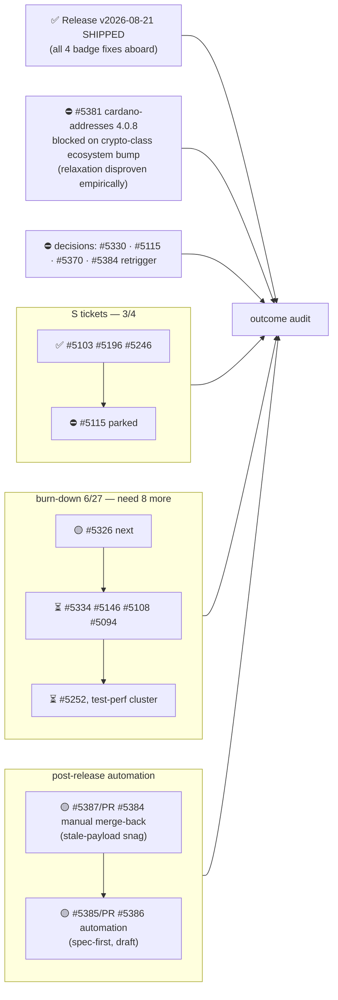

State — Updated: 2026-08-22
Legend: ✅ done · 🟡 active/next · ⏳ queued · 👤 external review · ⏸ paused · ⛔ blocked · ❓ unknown

- **Release v2026-08-21 shipped 2026-08-22** — the badge-green drive's product
  outcome. cardano-addresses stayed 4.0.2 by ruling; the requested upstream
  bound relaxation was then **empirically disproven** (memory→ram coupling,
  7 type errors at crypton 1.0.6) — #5381 now waits on a
  cardano-crypto-class ecosystem bump.
- New tech debt admitted to the milestone: #5385 (auto release merge-back).
- Desk ACTIVE; one operator-driven lane running (#5385/#5384 window); all
  desk-dispatched lanes archived.

GitHub milestone #113 "Drop cardano-api" is separate and out of scope.
