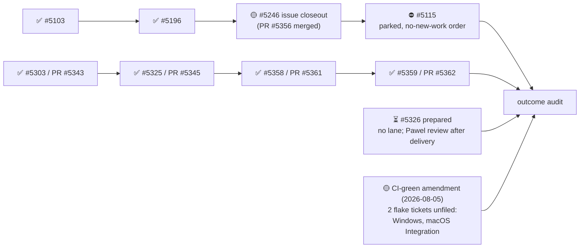

State — Updated: 2026-08-08
Legend: ✅ done · 🟡 active/next · ⏳ queued · 👤 external review · ⏸ paused · ⛔ blocked · ❓ unknown

- S-tickets: 3 of 4 closed (#5103, #5196, #5303-adjacent #5246-PR-only). #5115 remains
  open and parked; #5246's PR is merged but the issue itself is still open.
- Actionable-issue count against the outcome test's 14/27 threshold: **❓ not
  freshly recounted since the 2026-07-30 audit** — 7 confirmed closures are on
  record in the ledger (#5103, #5196, #5063, #5303, #5325, #5358, #5359); a
  full recount against the original 27-issue starting set has not been re-run.
  Treat the threshold as unverified, not as met.
- CI-green amendment (operator, 2026-08-05): all master README badges must be
  green at close. Two are red — both pre-existing flakes, neither caused by
  a #119 merge. Root-cause tickets are drafted but unfiled, blocked on
  release from the machine-wide pause.
- ⏸ Desk PARKED under `OMNIA-PAUSA-2026-08-08` (declared 20:55Z). Resumes on
  RELEASE from the machine owner.

GitHub milestone #113 "Drop cardano-api" is separate and out of this desk's
scope.
