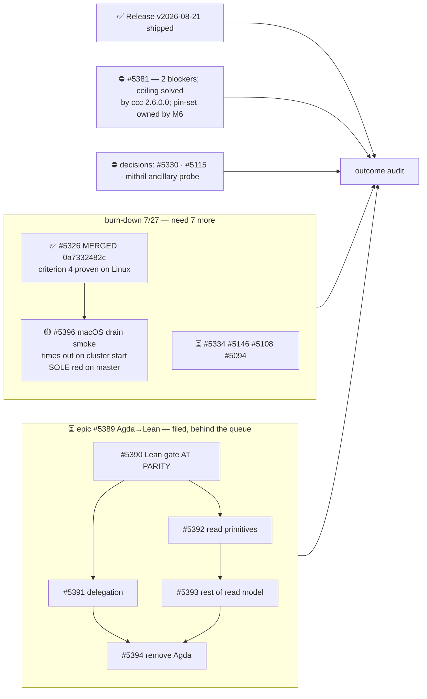

State — Updated: 2026-08-25
Legend: ✅ done · 🟡 active/next · ⏳ queued · ⛔ blocked · ❓ unknown · 👤 external review · ⏸ paused



**Released 2026-08-25T13:20Z**, full Wallet scope, operator authority, both order
hashes recomputed here. The desk is ACTIVE. The operator knowingly reopened a
metered lane, so this is capacity — not a waiver of any gate.

## ✅ #5326 merged — and burn-down is 7/27

PR #5388 merged as `0a7332482c` (parents `ab51934b7b` + the exact audited head
`df1cdf6dc6`, unrewritten). Criterion 4 verified on the merged head: two workers,
real SIGTERM, both close callbacks, bounded at 22.3 s — **on Linux**.

## 🟡 master is red, and it is ours — but not a regression

`0a7332482c` carries **99 success / 1 failure**. The sole failure is
`Conway Integration Tests (macOS)`, and within it the sole failing test is the
drain smoke #5326 introduced:

```
user error (cluster start timed out)
ShutdownDrain.hs:154:5   (180159 ms)
```

**The obvious reading of that red is wrong, and the correction is on the record.**
The *previous* master commit `ab51934b7b` had the same macOS job failing with
**54 failures** (`Faucet: no more mnemonics available`) and no drain test present
at all. **54 → 1.** #5326 made this job dramatically better and left one new
failing test behind. "Added a failing test on a platform its PR never exercised"
and "introduced a regression" are different claims, and only the first is true.

What the evidence supports:

- **The drain logic is not implicated.** Its success diagnostic
  (`shutdown drain acquired=… closed=…`) is *absent* from the macOS log entirely
  — the test never reached the drain. *(Verified by positive control: the same
  search finds 119 other matches in that log, so the absence is real.)*
- **The check can still fail.** Both of the smoke's negative controls pass on
  macOS.
- Only the smoke's **own second `local-cluster`** missed a 180 s budget tuned to
  Linux timings.

**Criterion 4: proven on Linux, unproven on macOS.**

**#5396 filed** to fix it, with an explicit non-goal — *do not skip the smoke on
macOS*. Skipping the platform where a live-boundary proof fails converts
criterion 4 into a check that cannot fail there, which is the exact failure this
milestone has spent the day guarding against. #5326 stays terminal and is not
reopened.

## Sequencing — one inversion proposed, not taken

#5396 is the strongest candidate to run **ahead of** the paved queue
(#5334 / #5146 / #5108 / #5094): it is the only item keeping master red, and it
protects an acceptance criterion this milestone just delivered. Recorded with its
reason and left with the project owner rather than performed silently. Epic
#5389 stays behind the whole queue per the operator ruling.

## Unchanged

#5381 parked on two verified blockers, its public record corrected — the crypton
ceiling is solved upstream by `cardano-crypto-class 2.6.0.0`; the remaining
in-repo pin-set question is owned by M6. #5293 sits behind it. Open operator
decisions: #5330, #5115, the mithril ancillary probe.
