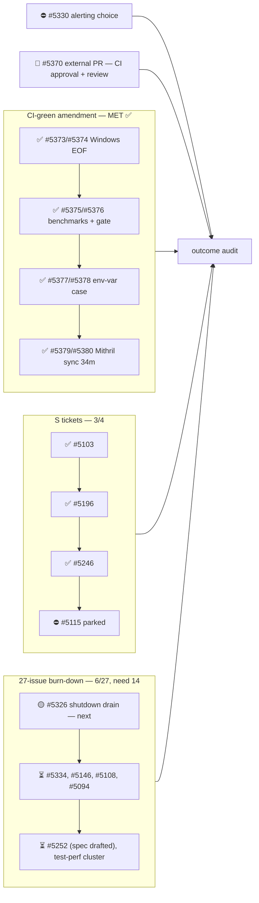

State — Updated: 2026-08-19
Legend: ✅ done · 🟡 active/next · ⏳ queued · 👤 external review · ⏸ paused · ⛔ blocked · ❓ unknown

- **Badges: all 9 green** at master `6761259ee9` — the 08-05 amendment is met.
  Mithril Sync (0% pass rate for a month, silent ~13h replay fallback +
  broken timeout cleanup) fixed and verified on a real 34m20s run.
- **Honest recount 2026-08-19**: the numeric burn-down is at **6/27** (the
  badge drive closed newly-filed issues, which don't count toward the
  starting set). 8 more closures needed. Queue paved — see ledger.
- #5341 closed as completed-by-#5380 (it was the pre-existing Mithril
  timeout ticket).
- Desk ACTIVE, no lanes in flight, no open PRs owned by this desk.

GitHub milestone #113 "Drop cardano-api" is separate and out of scope.
