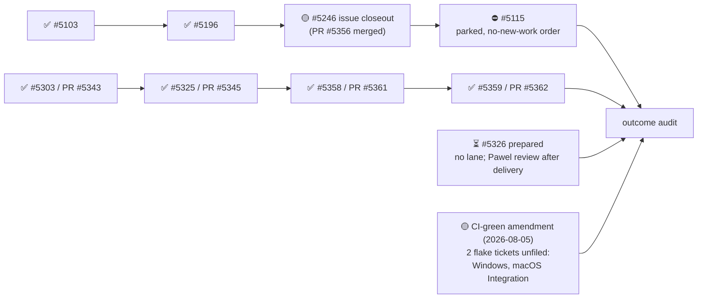

State — Updated: 2026-08-11
Legend: ✅ done · 🟡 active/next · ⏳ queued · 👤 external review · ⏸ paused · ⛔ blocked · ❓ unknown

- No change since 2026-08-08: master head unchanged (`d3d170d0`), no new merges.
  Confirmed by direct readback, not assumed from the last sweep.
- S-tickets: 3 of 4 closed (#5103, #5196, plus #5246's PR). #5115 remains open
  and parked; #5246's PR is merged but the issue itself is still open.
- Actionable-issue count against the outcome test's 14/27 threshold: **❓ still
  not freshly recounted** since the 2026-07-30 audit — 7 confirmed closures on
  record. Unverified, not met.
- CI-green amendment: still 2 red badges (Windows, macOS Integration), both
  confirmed unchanged pre-existing flakes as of this sweep — same failing runs
  as 2026-08-05, no new run since (master hasn't moved). Root-cause tickets
  drafted but unfiled, blocked on release.
- ⏸ Desk PARKED under `OMNIA-PAUSA-2026-08-11` (declared 18:35Z). The
  machine-wide CI-runner outage this pause reports as restored was unrelated
  to our two flakes (github-runner version, not test content).

GitHub milestone #113 "Drop cardano-api" is separate and out of this desk's
scope.
