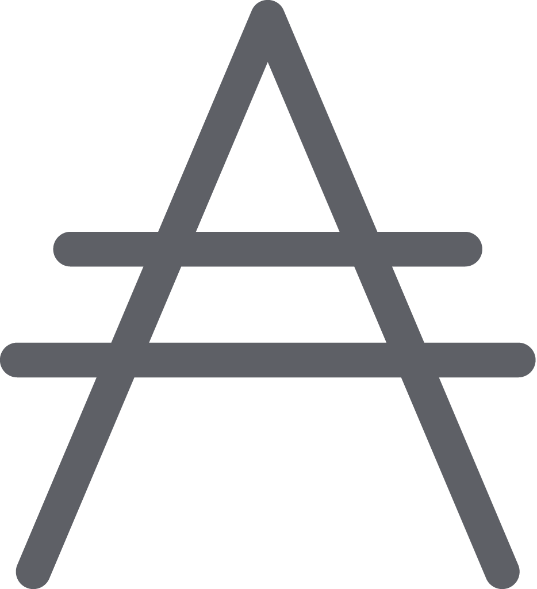

<p align="center">
  <big><strong>Cardano Wallet</strong></big>
</p>

<p align="center">
  
</p>

<p align="center">
    <a href="https://github.com/cardano-foundation/cardano-wallet/releases">
        
    </a>
    <a href="https://buildkite.com/cardano-foundation/cardano-wallet">
        
    </a>
    <a href="https://github.com/cardano-foundation/cardano-wallet/actions/workflows/publish.yml">
        
    </a>
    <a href="https://buildkite.com/cardano-foundation/cardano-wallet-nightly">
        
    </a>
    <a href="https://buildkite.com/cardano-foundation/cardano-wallet-release">
        
    </a>
    <a href="https://github.com/cardano-foundation/cardano-wallet/actions/workflows/windows.yml">
        
    </a>
    <a href="https://github.com/cardano-foundation/cardano-wallet/actions/workflows/e2e-windows.yml">
        
    </a>
</p>


<hr/>

## Overview

Cardano Wallet is software that helps you manage your Ada . You can use it to send and receive payments on the [Cardano blockchain](https://www.cardano.org).

This project provides an HTTP Application Programming Interface (API)
and command-line interface (CLI) for working with your wallet.

It can be used as a component of a frontend such as
[Daedalus](https://daedaluswallet.io), which provides a friendly user
interface for wallets. Most users who would like to use Cardano should
start with Daedalus.

## Quickstart

The `cardano-wallet` executable is an HTTP server that manages your wallet(s).

In order to retrieve blockchain data and send transactions, the `cardano-wallet` executable must connect to a running [`cardano-node`](https://github.com/IntersectMBO/cardano-node) process. This QuickStart guide presents you several ways of doing that, which you can later customize to your needs.


### Docker


You can use Docker to download, configure and start the `cardano-wallet` and `cardano-node` executables.

First you have to choose a Cardano network to connect to. The network `mainnet` keeps track of the real money. The networks `private`, `sanchonet`, and `preprod` are test networks.

`cd` into the directory `./run/$NETWORK/docker` corresponding to your choice of NETWORK.

Then
- start a node and wallet with `./run.sh start`
- stop the node and wallet with `./run.sh stop`
- inspect the logs with `./run.sh logs`
- start a node and wallet, wait until they are fully synchronized to the network, and stop again with `./run.sh sync`

### Variables
Accepeted variables for the start command are:
- `WALLET_PORT` (default 8090): the port the wallet will listen to on your host, in case of absence a random port will be used
- `WALLET_DB` (default `./databases/wallet-db`): the directory where the wallet database will be stored
- `NODE_DB` (default `./databases/node-db`): the directory where the node database will be stored
- `NODE_SOCKET_DIR` (default `./.`): the directory where the node socket will be created
- `NODE_CONFIGS`: the directory where the node configuration files will be retrieved from. In the absence of this variable, the node will use the configurations in the image.
      You have to reflect the directory structure of the node configuration files in the image to use the docker-compose.yml file.
- `WALLET_TAG` (default 2024.7.7): the tag of the wallet image to use, can be `release-candidate`

For example, to start a wallet on `private` network:

```bash
cd run/private/docker
WALLET_PORT=8090 ./run.sh start
curl http://localhost:8090/v2/network/information | jq
```

Then you can inspect the logs with

```bash
./run.sh logs
```

And stop the services with

```bash
./run.sh stop
```

See also [Docker](https://cardano-foundation.github.io/cardano-wallet/user-guide/installation/use-docker.html) for more information about using docker.

### .env file

You can set your variables populating the `.env` file in your working directory.

```bash

WALLET_PORT=8090
WALLET_DB=./my-databases/wallet-db
NODE_DB=./my-databases/node-db
NODE_SOCKET_DIR=/tmp/cardano-node-socket
NODE_CONFIGS=./my-configs-i-just-copied-from-a-malicious-site
WALLET_TAG=2024.10.20

```


### Nix

You can use [Nix](https://nixos.org) to download the `cardano-wallet` and `cardano-node` executables.

`cd` into the directory `./run/$NETWORK/nix` corresponding to your choice of NETWORK.

The nix script serve only as a template, you can modify it to suit your needs.
It actually support one only command `sync` that starts a wallet and a node and
use the wallet api to wait for the node to sync, then it stops the wallet and the node.

For example, to sync a node on `private` using nix:

```bash
cd run/private/nix
./run.sh sync
```

`WALLET_TAG` is not supported in the nix script. You will run the code that you just cloned.

NixOS users can also use the [NixOS service](https://cardano-foundation.github.io/cardano-wallet/user-guide/installation/use-nixos.html).

### Running on mainnet

On `mainnet`, the Minimum System Requirements for a `cardano-node` are high:

- 200GB of disk space (for the history of blocks)
- 24GB of RAM (for the current UTxO set)

To speed up the synchronization process,
you can download a snapshot of the `cardano-node` state database,
but you will have much less security than the full Ouroboros consensus protocol.
In particular, the snapshot could be created by a malicious block producer and
contain erroneous transactions that are not consensus on `mainnet`!

```bash
cd run/mainnet/docker
./snapshot.sh
```

The snapshot.sh will try to use `NODE_DB` as the directory to store the snapshot.

Wether you used a snapshot or not, you can now start the wallet with

```bash
cd run/mainnet/docker
./run.sh start
```

Notice that the wallet port is not exposed.
For security reasons **you should not expose** the wallet port to the internet.
The cardano-wallet **is not designed to be exposed** to the internet.
It would be no different from exposing the keys to your bank account to the internet!

You can connect to the wallet by attaching a container to the network and using the internal port.

```bash
docker run -it --network mainnet_default alpine/curl curl http://cardano-wallet:8090/v2/network/information | jq
```

Or modify the `docker-compose.yml` to host your client in the `mainnet_default` network.


### Running on preprod

Preprod network is broken for node 9.1.0 at some block in the past.
One way to overcome that limitation is to download a snapshot that used an old version node (1.35.2)
to trespass that point.
Use `snpashot.sh` to download the snapshot.

```bash
cd run/preprod/docker
./snapshot.sh
./run.sh sync
```

## Obtaining `cardano-wallet`

### Executables (Linux / Windows / Mac OS)

We provide executables as part of our [releases](https://github.com/cardano-foundation/cardano-wallet/releases). Please also see the installation instructions highlighted in the release notes.

### Building from source

See [Building](https://cardano-foundation.github.io/cardano-wallet/contributor/what/building.html)

### Testing

See [Testing](https://cardano-foundation.github.io/cardano-wallet/contributor/how/testing.html)

## History

The `cardano-wallet` repository was introduced during the [Shelley phase](https://roadmap.cardano.org/) of the Cardano blockchain.
Previously, during the Byron phase, the wallet was part of the [cardano-sl](https://github.com/input-output-hk/cardano-sl) repository. (This is useful to know — sometimes the ghosts of the past come back to haunt us in the form of obscure bugs.)

## Documentation

| Link                                                                                             | Audience                                                     |
| ------------------------------------------------------------------------------------------------ | ------------------------------------------------------------ |
| [Documentation](https://cardano-foundation.github.io/cardano-wallet/)                            |                                                              |
| • [User Manual](https://cardano-foundation.github.io/cardano-wallet/user)                        | Users of Cardano Wallet                                      |
| &nbsp;&nbsp;⤷ [CLI Manual](https://cardano-foundation.github.io/cardano-wallet/user/cli)         | Users of the Cardano Wallet API                              |
| &nbsp;&nbsp;⤷ [API Documentation](https://cardano-foundation.github.io/cardano-wallet/api/edge)  | Users of the Cardano Wallet API                              |
| • [Design Documents](https://cardano-foundation.github.io/cardano-wallet/design)                 | Anyone interested in wallet design and specifications        |
| &nbsp;&nbsp;⤷ [Specifications](https://cardano-foundation.github.io/cardano-wallet/design/specs) | Anyone interested in wallet design and specifications        |
| • [Contributor Manual](https://cardano-foundation.github.io/cardano-wallet/contributor)          | Anyone interested in the project and our development process |
| [Adrestia Documentation](https://input-output-hk.github.io/adrestia/)                            | Anyone interested in the project and our development process |

<hr/>

<p align="center">
  <a href="https://github.com/cardano-foundation/cardano-wallet/blob/master/LICENSE"></a>
</p>
