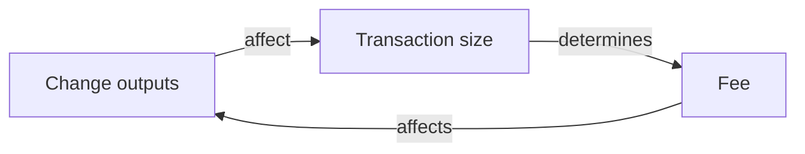
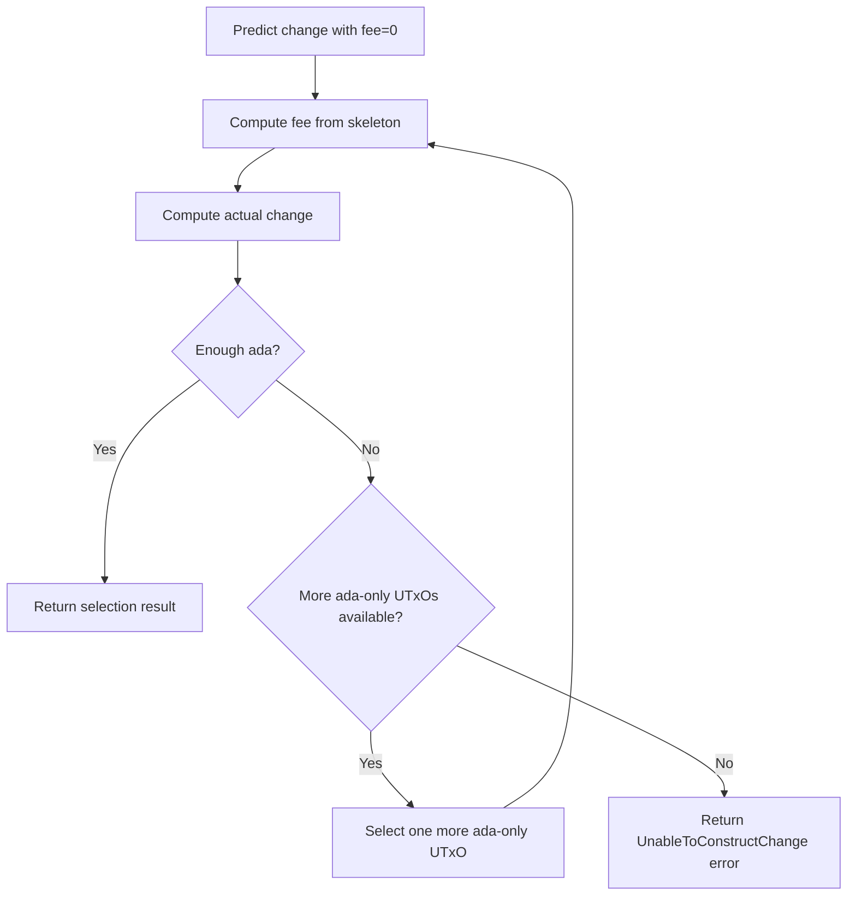

# Change Generation

After selecting inputs, the algorithm must distribute the excess value into
**change outputs** that are sent back to the wallet. This is handled by the
`makeChange` function.

## The chicken-and-egg problem

There is a circular dependency between change and fees:

- To compute the **fee**, we need to know the transaction size, which depends
  on the change outputs.
- To compute the **change**, we need to subtract the fee from the excess
  value.

### Resolution

The algorithm resolves this with a two-phase approach:

1. **Predict change shape** -- call `makeChange` with zero fees and zero
   minimum ada quantities. This always succeeds and yields the correct
   **asset composition** of change (but not the correct ada amounts).

2. **Estimate fee from skeleton** -- use the predicted change shape (number
   of change outputs and their asset sets) to estimate the transaction fee.

3. **Compute actual change** -- call `makeChange` with the estimated fee and
   real minimum ada quantities.

4. **Retry if needed** -- if there isn't enough ada to cover both the fee and
   the minimum ada quantities of change outputs, select one more ada-only input
   and repeat from step 2.

## Change for user-specified assets

For assets that appear in the user's requested outputs, the change quantity is
distributed **proportionally** to the original output weights.

Given an excess quantity $e$ of asset $a$ and output weights
$w_1, w_2, \ldots, w_n$:

$$
\text{change}_i = \left\lfloor e \cdot \frac{w_i}{\sum_j w_j} \right\rfloor + r_i
$$

where $r_i \in \{0, 1\}$ are rounding corrections ensuring the total equals
$e$ exactly. See [Partitioning](../math/partitioning.md) for details.

## Change for non-user-specified assets

Assets that were **not** in the original outputs but were selected as side
effects (because they shared a UTxO with a desired asset) are distributed
using the [padCoalesce](../math/coalescing.md) algorithm.

These change maps are sorted in **ascending partial order**, which ensures
that when combined with user-specified change maps, the smallest maps are
merged with the smallest maps.

## Assigning ada to change maps

After computing the asset change maps, the algorithm assigns ada quantities:

1. Assign the **minimum required ada** to each change map (based on its token
   bundle size).

2. Distribute any **remaining ada** proportionally to the original output
   coins.

If there isn't enough ada to cover all minimum quantities, the algorithm drops
**empty** change maps (those with no native tokens) from the start of the
list, reducing the total minimum ada required.

!!! info "Invariant"
    The number of change outputs is **at least** the number of user-specified
    outputs (unless ada is insufficient to fund that many change outputs).

## Splitting oversized change

If a change output exceeds the maximum allowed token bundle size, it is split
into smaller bundles using `equipartitionAssets`. If any individual token
quantity exceeds the protocol maximum, it is split using
`equipartitionQuantitiesWithUpperBound`.
