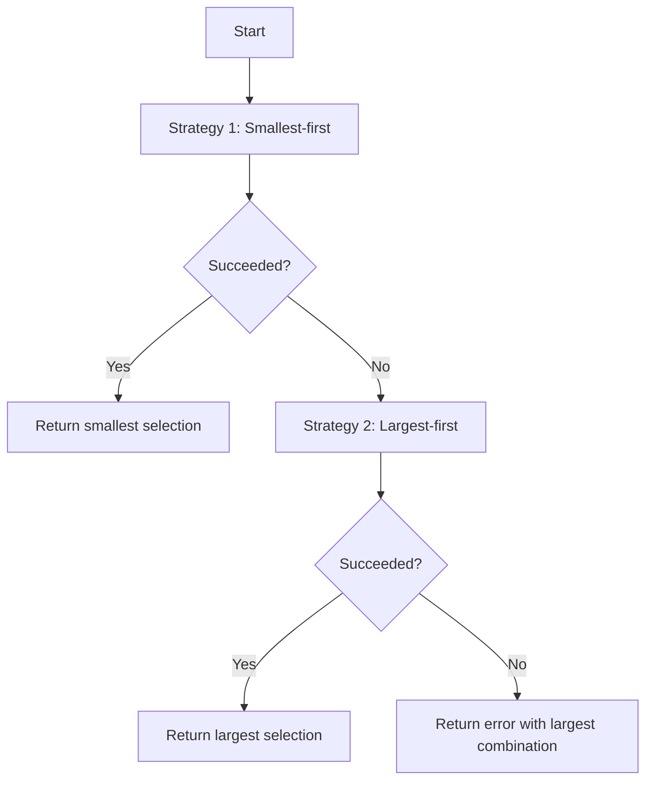

# Collateral Selection

Plutus script transactions on Cardano require **collateral** -- a set of
ada-only UTxOs that will be forfeited if the script fails validation.
The `Cardano.CoinSelection.Collateral` module provides a dedicated algorithm
for selecting collateral.

## Requirements

The protocol imposes two constraints on collateral:

1. **Size**: at most `maximumCollateralInputCount` UTxOs can be used
2. **Value**: the total value must be at least
   `minimumCollateralPercentage`% of the transaction fee

$$
\text{collateral} \geq \left\lceil \frac{\text{fee} \times \text{percentage}}{100} \right\rceil
$$

## Dual-strategy approach

The algorithm tries two strategies in sequence, picking the first that succeeds:

### Strategy 1: Smallest-first

This strategy produces an **optimal** result -- the smallest possible total
collateral amount.

1. Sort available coins in ascending order
2. Trim the list: discard coins after the first one that individually exceeds
   the minimum
3. Enumerate all combinations of size 1, 2, ..., up to `maximumSelectionSize`
4. For each size, find the smallest combination that meets the minimum
5. Return the overall smallest valid combination

!!! warning "Search space limit"
    The number of combinations can be exponential. The algorithm guards against
    this with a configurable `searchSpaceLimit` (default: 1,000,000). If the
    required search space exceeds this limit, the strategy fails without
    computing a result.

The search space for selecting $k$ coins from $n$ available is:

$$
\binom{n}{k} = \frac{n!}{k!(n-k)!}
$$

### Strategy 2: Largest-first

This fallback strategy always produces a result if one exists:

1. Take the `maximumSelectionSize` largest coins
2. Enumerate all submaps of this small set (at most $2^k$ submaps where
   $k \leq$ `maximumSelectionSize`, typically 3)
3. Return the smallest submap that meets the minimum

Since `maximumSelectionSize` is typically very small (3), this strategy
is always fast.

## Properties

If the selection **succeeds**, the result satisfies:

$$
\begin{aligned}
\sum \text{coinsSelected} &\geq \text{minimumSelectionAmount} \\
|\text{coinsSelected}| &\leq \text{maximumSelectionSize} \\
\text{coinsSelected} &\subseteq \text{coinsAvailable}
\end{aligned}
$$

If the selection **fails**, the error reports:

$$
\begin{aligned}
\sum \text{largestCombination} &< \text{minimumSelectionAmount} \\
|\text{largestCombination}| &\leq \text{maximumSelectionSize} \\
\text{largestCombination} &\subseteq \text{coinsAvailable}
\end{aligned}
$$

## Integration with balance selection

Collateral selection runs **after** the main balance selection. The balance
selection reserves space for collateral inputs ahead of time by adding
`maximumCollateralInputCount` to the skeleton input count when estimating fees.

This ensures the fee already accounts for the collateral inputs, even though
the exact collateral UTxOs are not yet known. The slight overestimation (since
fewer collateral inputs may actually be needed) results in a marginally higher
fee, which is acceptable given the small size of `maximumCollateralInputCount`.
