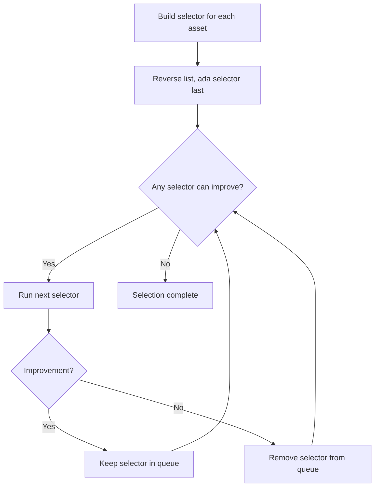

# Selection Strategies

The library provides two selection strategies that control **how much** of each
asset the algorithm selects relative to the minimum required.

## SelectionStrategyOptimal

The default strategy. For each asset, the algorithm targets approximately
**twice** the minimum required amount:

$$
\text{target}(a) = 2 \times \text{minimum}(a)
$$

This means that after paying for the required outputs, the remaining value is
returned as change that is roughly the **same size** as the original outputs.

!!! success "When to use"
    Use for most transactions. This strategy helps the wallet's UTxO
    distribution evolve to match the user's typical payment patterns,
    increasing the likelihood that future selections succeed and lowering
    amortized transaction costs.

### Example

If the user sends 100 ada, the algorithm targets selecting ~200 ada worth of
inputs, producing ~100 ada in change. This change output is similar in size
to the payment, maintaining a balanced UTxO set.

## SelectionStrategyMinimal

Selects **just enough** of each asset to meet the minimum required:

$$
\text{target}(a) = 1 \times \text{minimum}(a)
$$

The selection terminates as soon as the minimum is covered.

!!! warning "When to use"
    Use only as a fallback when the optimal strategy fails. Regular use of the
    minimal strategy leads to small, fragmented change outputs that degrade the
    wallet's UTxO set over time.

### Example

If the user sends 100 ada, the algorithm selects ~100 ada of inputs, producing
very little change. The small change outputs are less useful for future
transactions.

## The Round-Robin algorithm

Both strategies share the same underlying **Random-Round-Robin** algorithm.
The algorithm processes each asset in turn, selecting UTxOs randomly until
all assets reach their target.

### Selection step logic

For a given asset, a single selection step works as follows:

1. If the current selected quantity is **below** the minimum, select another
   UTxO containing that asset.

2. If the current selected quantity is **at or above** the minimum, select
   another UTxO only if it brings the total **closer to the target** (but not
   further away).

$$
\text{improvement}(s') = |q(s') - \text{target}| < |q(s) - \text{target}|
$$

where $q(s)$ is the selected quantity of the asset in state $s$.

### UTxO selection priority

When selecting a UTxO for a given asset $a$, the algorithm tries these filters
in order of priority:

1. **Singleton**: a UTxO containing **only** asset $a$ (and ada)
2. **Pair**: a UTxO containing asset $a$ and **exactly one** other asset
3. **Any**: any UTxO containing asset $a$

This priority order minimises "collateral damage" -- the selection of
unwanted assets alongside the desired one.

### Ada is selected last

The ada selector is run **last** in the round-robin. Since every UTxO
necessarily contains ada, selecting UTxOs for other assets first increases the
probability that the ada requirement is already satisfied without needing
additional ada-only inputs.
