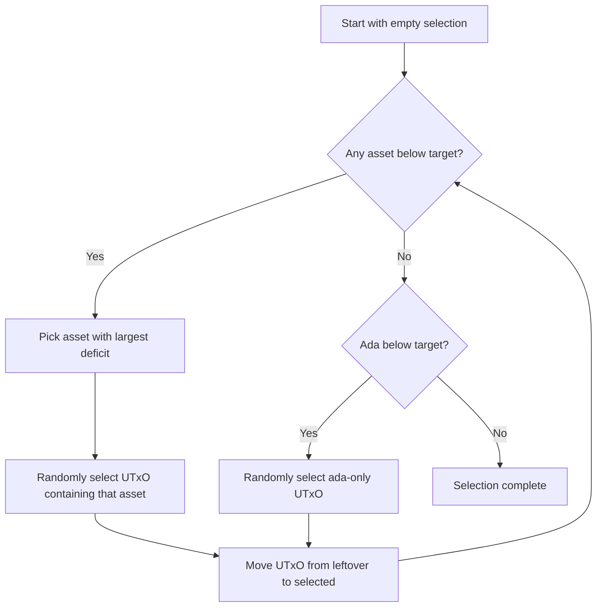
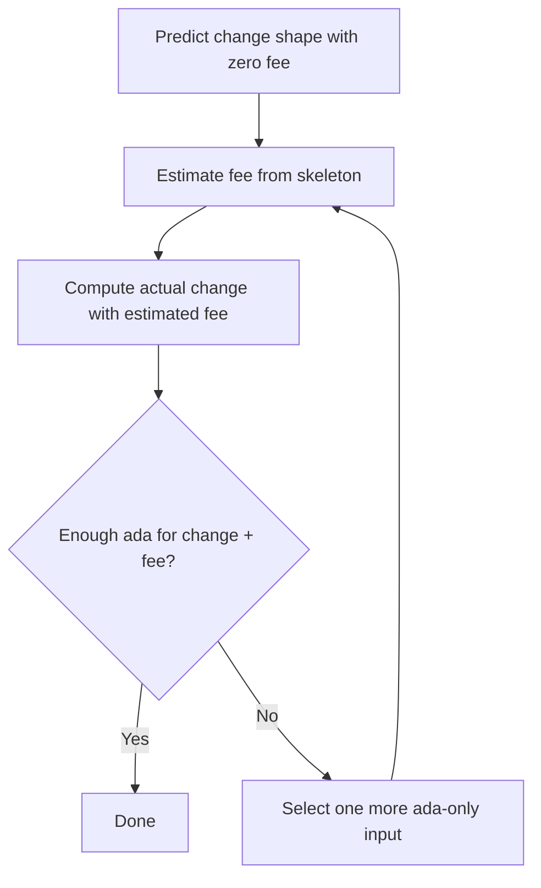

# Tutorial

This tutorial walks through a complete coin selection from start to finish.

## Scenario

Alice has a wallet with the following UTxO set and wants to send 15 ada and
3 tokens of asset X to Bob.

### Alice's UTxO set

| UTxO | Ada | Asset X |
|------|-----|---------|
| u1   | 10  | 0       |
| u2   | 5   | 2       |
| u3   | 20  | 0       |
| u4   | 3   | 5       |

### Desired output

| Recipient | Ada | Asset X |
|-----------|-----|---------|
| Bob       | 15  | 3       |

## Step 1: Build the UTxO index

The first step is to build a `UTxOIndex` from Alice's UTxO set. The index
maintains a mapping from each asset to the subset of UTxOs containing that
asset, enabling efficient random selection.

```haskell
let utxoIndex = UTxOIndex.fromMap $ Map.fromList
        [ (u1, TokenBundle (Coin 10) mempty)
        , (u2, TokenBundle (Coin 5)  (TokenMap.singleton assetX (TokenQuantity 2)))
        , (u3, TokenBundle (Coin 20) mempty)
        , (u4, TokenBundle (Coin 3)  (TokenMap.singleton assetX (TokenQuantity 5)))
        ]
```

## Step 2: Configure selection parameters

```haskell
let params = SelectionParams
        { outputsToCover =
            [ (bobAddress, TokenBundle (Coin 15)
                (TokenMap.singleton assetX (TokenQuantity 3)))
            ]
        , utxoAvailableForInputs = UTxOSelection.fromIndex utxoIndex
        , utxoAvailableForCollateral = mempty
        , collateralRequirement = SelectionCollateralNotRequired
        , extraCoinIn  = Coin 0
        , extraCoinOut = Coin 0
        , assetsToMint = mempty
        , assetsToBurn = mempty
        , selectionStrategy = SelectionStrategyOptimal
        }
```

## Step 3: The selection algorithm runs

Internally, the algorithm proceeds through several phases:

### Phase 1: Random-Round-Robin selection



With the **Optimal** strategy, the algorithm targets **twice** the minimum
required amount of each asset. This produces change outputs that are roughly
the same size as the user-specified outputs.

For our example, the algorithm needs at least 3 tokens of asset X. With the
optimal strategy it targets 6. It might select:

- **u4** (3 ada, 5 asset X) -- provides 5 of the targeted 6 asset X
- **u2** (5 ada, 2 asset X) -- provides 2 more asset X (total: 7, close to target 6)
- **u3** (20 ada) -- provides additional ada to reach the ada target

### Phase 2: Change generation

Once inputs are selected, the algorithm computes change:

$$
\text{change} = \sum \text{inputs} + \text{mints} - \sum \text{outputs} - \text{burns} - \text{fee}
$$

For our example (assuming fee = 0.2 ada):

| | Ada | Asset X |
|---|---|---|
| Inputs (u2 + u3 + u4) | 28 | 7 |
| Outputs (Bob) | -15 | -3 |
| Fee | -0.2 | 0 |
| **Change** | **12.8** | **4** |

The change is distributed proportionally to the original outputs. Since there
is only one output, all change goes into a single change output sent back to
Alice.

### Phase 3: Fee estimation loop

There is a chicken-and-egg problem: we need to know the fee to compute change,
but we need to know the change to compute the fee (since change affects
transaction size).



The algorithm resolves this by:

1. First computing a "prediction" of change with zero fees
2. Using that prediction to estimate the fee
3. Then computing actual change with the real fee
4. If ada is insufficient, selecting one more input and repeating

## Step 4: Inspect the result

```haskell
case result of
    Left err -> handleError err
    Right selection -> do
        -- Selected inputs (non-empty list)
        let inputs = CS.inputs selection

        -- User-specified outputs
        let outputs = CS.outputs selection

        -- Generated change outputs (sent back to Alice)
        let change = CS.change selection

        -- The selection surplus covers the fee
        let surplus = CS.selectionDeltaAllAssets selection
```

## Summary

The coin selection algorithm balances several competing concerns:

- **Covering the outputs**: enough value must be selected
- **Minimising fees**: don't select unnecessarily many inputs
- **Self-organisation**: target ~2x the minimum to produce useful change
- **Privacy**: change should resemble typical outputs
- **Correctness**: all invariants are maintained and verified
