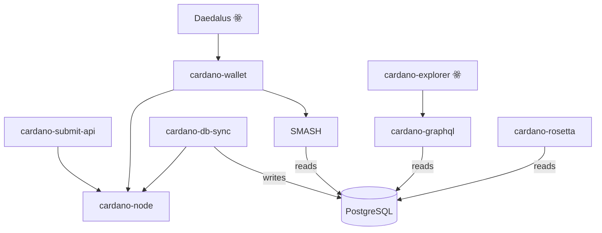
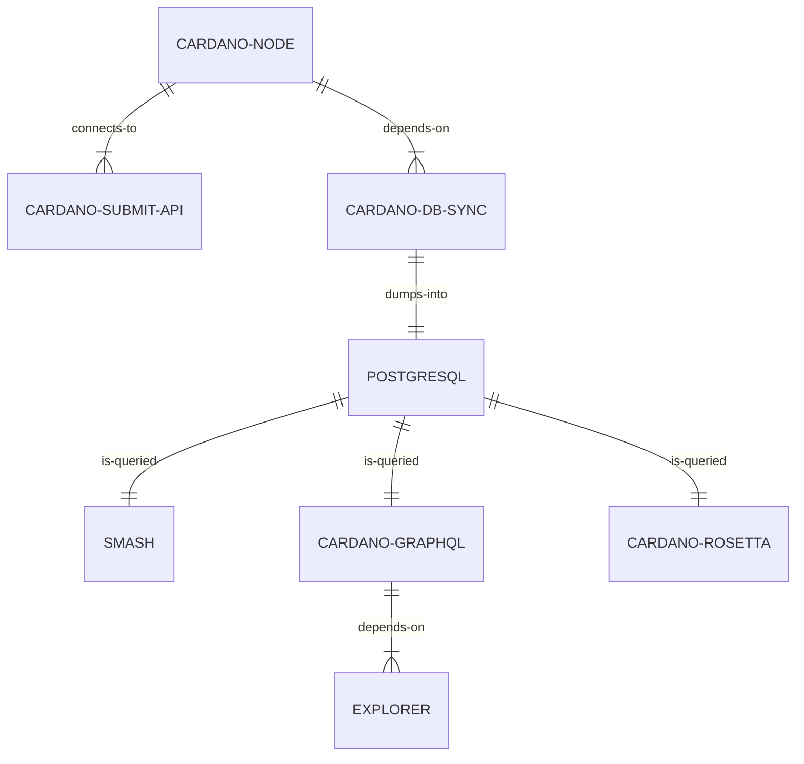
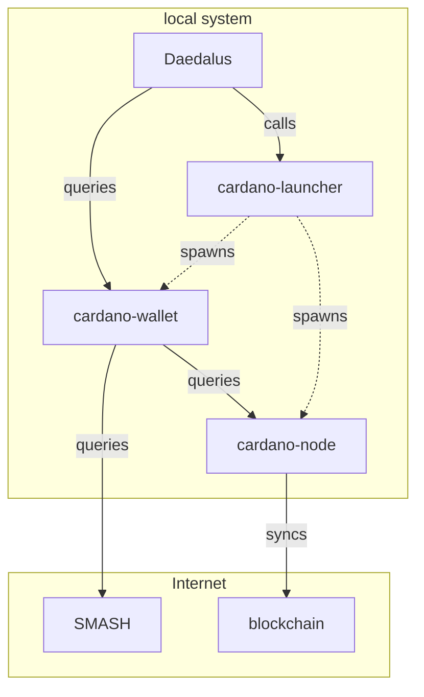

# Adrestia Architecture

Adrestia is a collection of products which makes it easier to integrate with Cardano.

It comes in different flavours: SDK or high-level APIs. Depending on the use-cases you have and the control that you seek, you may use any of the components below.

## Services

Service applications for integrating with Cardano.

- [cardano-wallet]: HTTP REST API for managing UTxOs, and much more.
- [cardano-graphql]: HTTP GraphQL API for exploring the blockchain.
- [cardano-rosetta]: [Rosetta](https://www.rosetta-api.org/docs/1.4.4/welcome.html) implementation for Cardano.
- [cardano-submit-api]: HTTP API for submitting signed transactions.

## Software Libraries

- [cardano‑addresses]: Address generation, derivation &  mnemonic manipulation.
- [cardano-coin-selection]: Algorithms for coin selection and fee balancing.
- [cardano-transactions]: Utilities for constructing and signing transactions.
- [bech32][bech32]: Haskell implementation of the Bech32 address format (BIP 0173).

[cardano‑addresses]: https://github.com/input-output-hk/cardano-addresses
[bech32]: https://github.com/input-output-hk/bech32


## High-Level Dependency Diagram




## Component Synopsis

### [cardano-node]

The core [cardano-node][], which participates in the Cardano network, and maintains the state of the Cardano blockchain ledger.

#### Cardano Network Protocol

An implementation of the protocol is [here][ouroboros-network], deployed as stake pool nodes and relay nodes to form the Cardano network.

[ouroboros-network]: https://github.com/input-output-hk/ouroboros-network
[cardano-node]: https://github.com/input-output-hk/cardano-node

### [cardano-wallet]

[cardano-wallet][] An HTTP REST API is recommended for 3rd party wallets and small exchanges who do not want to manage UTxOs for transactions themselves. Use it to send and receive payments from hierarchical deterministic wallets on the Cardano blockchain via HTTP REST or a command-line interface.

### [cardano‑launcher]

This is a small Typescript package for NodeJS applications which manages the configuration and lifetime of [cardano-wallet] and [cardano-node] processes.

### [cardano-db-sync][cardano-db-sync]

This application stores blockchain data fetched from [cardano-node][] in a PostgreSQL database to enable higher-level interfaces for blockchain exploration. It powers [cardano-graphql][].

### [cardano-graphql][]

A GraphQL API for Cardano, which also serves as the backend of
[Cardano Explorer](https://explorer.cardano.org/).

### [cardano-submit-api][]

A small HTTP API for submitting transactions to a local [cardano-node][].

The transaction must be fully signed and CBOR-encoded. This could be done by [cardano-cli][], for example.

### [cardano-rosetta][]

[Cardano-rosetta][] is an implementation of the [Rosetta](https://www.rosetta-api.org/docs/1.4.4/welcome.html) specification for Cardano. Rosetta is an open-source specification and set of tools that makes integrating with blockchains simpler, faster, and more reliable.

### [SMASH][]

The Stakepool Metadata Aggregation Server [for Hashes] is basically a proxy of the metadata published by stake pool owners. It improves performance of the network by taking load off the various web servers which host the actual metadata.

Clients such as `cardano-wallet` must verify the integrity of metadata served by a SMASH server by comparing the metadata's content hash with that in the stake pool registration certificate.

## Component Relationships: Explorer Scenario



## Component Relationships: Wallet Scenario



## Components

### APIs

| Name / Link        | Description                                    | Byron | Jörm | Shelley | Mary | Alonzo |
| ------------------ | ---------------------------------------------- | ----- | ---- | ------- | ---- | ------ |
| [cardano-wallet]   | JSON/REST API for managing UTxOs in HD wallets | ✔     | ✔    | ✔       | ✔    | ✔      |
| [cardano-graphql]  | GraphQL/HTTP API for browsing on-chain data    | ✔     | ❌    | ✔       | ✔    | ✔      |
| [cardano-rosetta]  | Implementation of [Rosetta][] spec for Cardano |       |      | ✔       | ✔    | 🚧      |
| ~~[cardano-rest]~~ | _Deprecated_                                   | ✔     | ❌    | ✔       | ❌    | ❌      |

[cardano-rosetta]: https://github.com/input-output-hk/cardano-rosetta
[rosetta]: https://www.rosetta-api.org/

### CLIs

| Name / Link                | Description                                          | Byron | Jörm | Shelley | Mary | Alonzo |
| -------------------------- | ---------------------------------------------------- | ----- | ---- | ------- | ---- | ------ |
| [bech32]                   | Human-friendly Bech32 address encoding               | N/A   | ✔    | ✔       | ✔    | ✔      |
| [cardano-wallet]           | Command-line for interacting with cardano-wallet API | ✔     | ✔    | ✔       | ✔    | ✔      |
| [cardano‑addresses]        | Addresses and mnemonic manipulation & derivations    | ✔     | ✔    | ✔       | ✔    | ✔      |
| ~~[cardano-transactions]~~ | _Deprecated_                                         | ✔     | ❌    | ❌       | ❌    | ❌      |

### Haskell SDKs

| Name / Link                  | Description                                       | Byron | Jörm | Shelley | Mary | Alonzo |
| ---------------------------- | ------------------------------------------------- | ----- | ---- | ------- | ---- | ------ |
| [bech32]                     | Human-friendly Bech32 address encoding            |       | ✔    | ✔       | ✔    | ✔      |
| [cardano‑addresses]          | Addresses and mnemonic manipulation & derivations | ✔     | ✔    | ✔       | ✔    | ✔      |
| ~~[cardano-coin-selection]~~ | _Deprecated_                                      | ✔     | ✔    | ✔       | ❌    | ❌      |
| ~~[cardano-transactions]~~   | _Deprecated_                                      | ✔     | ❌    | ❌       | ❌    | ❌      |

### Rust SDKs (+WebAssembly support)

| Name / Link                    | Description                                           | Byron | Jörmungandr | Shelley |
| ------------------------------ | ----------------------------------------------------- | ----- | ----------- | ------- |
| [cardano-serialization-lib]    | Binary serialization of on-chain data types           | N/A   | N/A         | ✔       |
| [react-native-haskell-shelley] | React Native bindings for [cardano-serialization-lib] | N/A   | N/A         | 🚧       |

### JavaScript SDKs

| Name / Link         | Description                                                                      | Byron | Jörm | Shelley | Mary | Alonzo |
| ------------------- | -------------------------------------------------------------------------------- | ----- | ---- | ------- | ---- | ------ |
| [cardano‑launcher]  | Typescript library for starting and stopping [cardano-wallet] and [cardano-node] |       | ❌    | ✔       | ✔    | ✔      |
| [cardano‑addresses] | Address validation and inspection                                                | ✔     | ✔    | ✔       | ✔    | ✔      |

[cardano‑launcher]: https://github.com/input-output-hk/cardano-launcher

### Formal Specifications

| Name / Link                 | Description                            |
| --------------------------- | -------------------------------------- |
| [utxo-wallet-specification] | Formal specification for a UTxO wallet |

[utxo-wallet-specification]: https://github.com/input-output-hk/utxo-wallet-specification

### Internal

```admonish warning
These tools are used internally by other tools and
does not benefit from the same care in documentation than other tools above.
```

| Name / Link  | Description                                                          |
| ------------ | -------------------------------------------------------------------- |
| [persistent] | Fork of the persistent Haskell library maintained for cardano-wallet |

[persistent]: https://github.com/input-output-hk/persistent


[cardano-cli]: https://docs.cardano.org/projects/cardano-node/en/latest/reference/cardano-node-cli-reference.html
[cardano-coin-selection]: https://github.com/input-output-hk/cardano-coin-selection
[cardano-db-sync]: https://github.com/input-output-hk/cardano-db-sync
[cardano-graphql]: https://github.com/input-output-hk/cardano-graphql
[cardano-node]: https://github.com/input-output-hk/cardano-node
[cardano-rest]: https://github.com/input-output-hk/cardano-rest
[cardano-serialization-lib]: https://github.com/Emurgo/cardano-serialization-lib
[cardano-sl-explorer]: https://cardanodocs.com/technical/explorer/api/
[cardano-submit-api]: https://github.com/input-output-hk/cardano-node/tree/master/cardano-submit-api
[cardano-transactions]: https://github.com/input-output-hk/cardano-transactions
[cardano-wallet]: https://github.com/cardano-foundation/cardano-wallet
[ouroboros]: https://iohk.io/en/research/library/papers/ouroboros-praosan-adaptively-securesemi-synchronous-proof-of-stake-protocol/
[react-native-haskell-shelley]: https://github.com/Emurgo/react-native-haskell-shelley
[smash]: https://github.com/input-output-hk/smash
