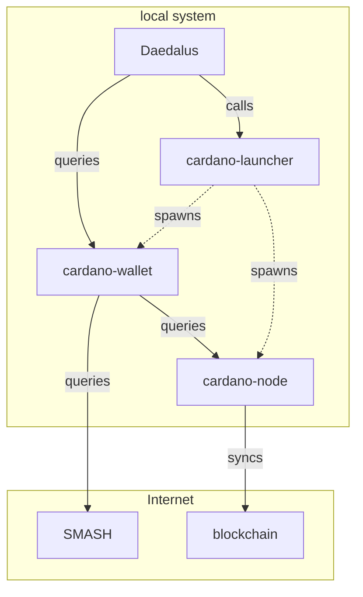

# Architecture Diagram

This is how the software components fit together in the [Daedalus](#daedalus) scenario.

See also: [Adrestia Architecture](adrestia-architecture.md).

## Node

The core [cardano-node], which participates in the Cardano network, and maintains the state of the Cardano blockchain ledger.

## Wallet Backend

[cardano-wallet] is an HTTP REST API is recommended for 3rd party wallets and small exchanges who do not want to manage UTxOs for transactions themselves. Use it to send and receive payments from hierarchical deterministic wallets on the Cardano blockchain via HTTP REST or a command-line interface.

## Cardano Launcher

[cardano-launcher] is a TypeScript package which handles the details of starting and stopping the Node and Wallet Backend.

## Daedalus

[Daedalus] is a user-friendly desktop application to manage Cardano wallets.

## SMASH

[SMASH] is a proxy for stake pool metadata.

[cardano-node]: https://github.com/IntersectMBO/cardano-node
[cardano-wallet]: https://github.com/cardano-foundation/cardano-wallet
[cardano-launcher]: https://github.com/IntersectMBO/cardano-launcher
[daedalus]: https://github.com/input-output-hk/daedalus
[SMASH]: https://github.com/input-output-hk/smash
