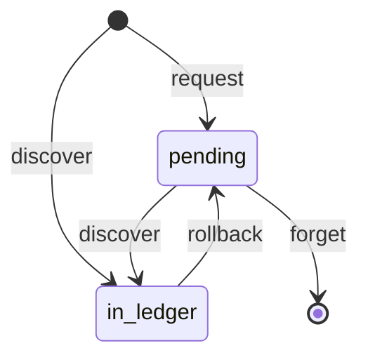
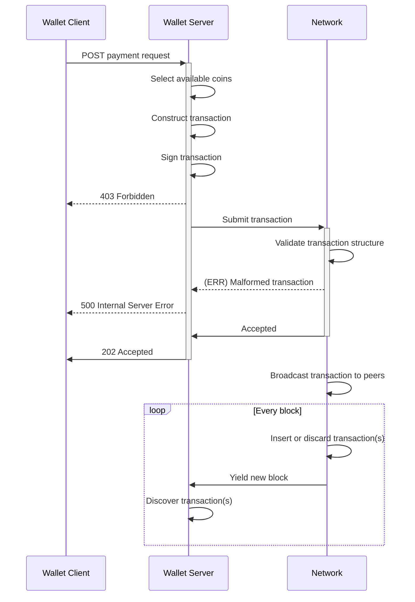

# Transaction Lifecycle

> This needs to be updated to include transaction resubmission by the wallet.

## States

### State transition: `forget`

Importantly, a transaction, when sent, cannot be cancelled. One can only
request forgetting about it in order to try spending (concurrently) the same
UTxO in another transaction. But, the transaction may still show up later in a
block and therefore, appear in the wallet.

### State transition: `discover`

Discovering a transaction happens regardless of a transaction being present
or not as `pending` . Actually, only outgoing transactions are going through
the `pending` state. Incoming ones or, outgoing ones that have been forgotten
may be discovered directly in blocks.

## Submission

