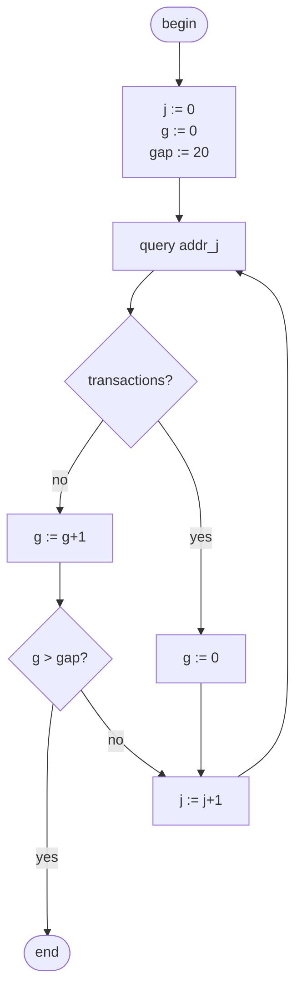
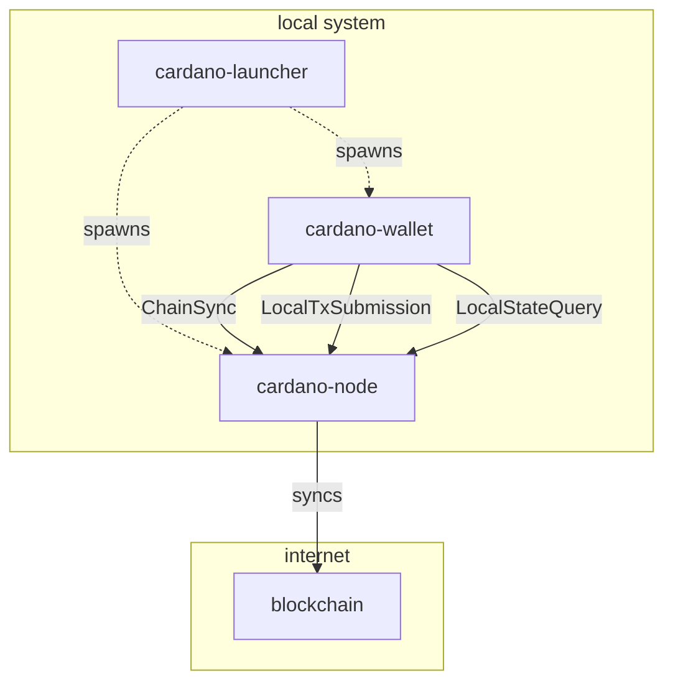
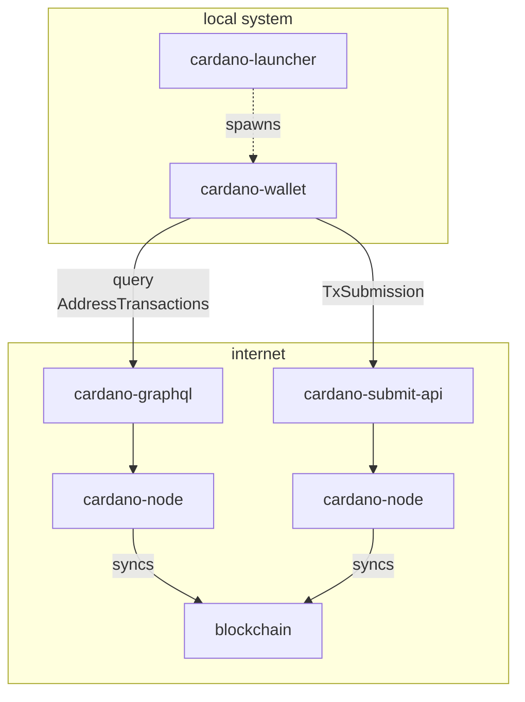

# Specification: Light mode for cardano-wallet

11th Feb 2022

Status: DRAFT

# Synopsis

This document specifies a light-mode for `cardano-wallet`.
This mode aims to make synchronisation to the blockchain faster by trusting an off-chain source of aggregated blockchain data.

Light wallets often employ this strategy of using a less trusted data source; for example the [Nami][] wallet uses [Blockfrost][] as data source. The purpose of the light-mode of `cardano-wallet` is to make this "trust vs speed" trade-off readily available to downstream software such as [Daedalus][] with *minimal* changes to its downstream API.

In addition, the "trust versus speed" trade-off will be partially obsoleted by [Mithril][] technology, which aims to give us "trust *and* speed" by providing verified ledger state data as opposed to block data. The act of implementing light-mode in `cardano-wallet` does not only offer immediate benefits, but will, in fact, partially prepare the codebase for Mithril technology.

  [daedalus]: https://daedaluswallet.io
  [nami]: https://namiwallet.io
  [blockfrost]: http://blockfrost.io
  [mithril]: https://iohk.io/en/research/library/papers/mithrilstake-based-threshold-multisignatures/

# Motivation

## Background

As the Cardano blockchain grows in size, retrieving and verifying blocks from the consensus network becomes increasingly time consuming. By making a "trust versus speed" trade-off, we can significantly decrease synchronization times.

## User-visible benefits

* Allow users to operate their wallet without needing to wait for the node to download and validate the entire blockchain.
* Allow users to run cardano-wallet and Daedalus on systems with significantly less than 8GB of memory and less than 10GB of disk space.
* Allow users to control where they sit on the trust vs convenience spectrum, depending upon their current circumstances.

## Technical benefits

* *Speed*. With light-mode, we expect synchronisation times of < 1 minute for a wallet with 1'000 transactions. In contrast, synchronisation of an empty wallet currently takes ~ 50 minutes by connecting to a node — assuming that the node has already synced to the chain tip and built its ledger state, which itself takes hours.
* *Compatibility*. Light-mode is intended to preserve the API presented to downstream software such as [Daedalus][], only *minimal* changes are expected.
* *Optionality*. A wallet that was started in light-mode can be restarted in full mode without resynchronization, and vice versa. (MVP: no support yet for changing the mode dynamically while the wallet is running.)

## Limitations

* *Trust*. The external data source does *not* provide the same level of protection against *omission* of transactions as the Proof-of-Stake consensus protocol.
* *Privacy*. In addition to the reduction of trust in the blockchain data, we now also reveal private information about addresses belonging to a single wallet.
* *Address schemes*. Only *Shelley* wallets with *sequential address discovery* can be supported.

However, these limitations are shared by all existing light wallets. In fact, some light wallets only provide *single-address* wallets, which is an additional reduction of privacy.

# Specification

## Overview

The implementation of light-mode is based on an efficient query `Address -> Transactions` which the blockchain data source provides. This query is useful to wallets that use *sequential address discovery* (Shelley wallets). These wallets work with a sequence of potential addresses `addr_0`, `addr_1`, `addr_2`, …. For each integer `n`, there is a deterministic procedure for generating the corresponding address `addr_n`. The wallet generates the first few addresses in this sequence and uses the above query to retrieve the corresponding transactions. When no transactions are found for `g` ("address gap") many consecutive addresses, the procedure stops — as the wallet never puts addresses with higher indices on the chain. In other words, this iterative loop yields all transactions that belong to the wallet.

This procedure can be visualized in a flow chart:



This procedure is implemented and demonstrated in the `light-mode-test` prototype.

## Functionality

### Network topology

In full-node mode, `cardano-wallet` connects to a local `cardano-node`:



In light-mode, `cardano-wallet` instead connects to the data source (e.g. `cardano-graphql` or [Blockfrost][]) and a transaction submission service through the internet



### Command line

The `cardano-wallet` executable will feature a new flag `--light` which indicates that the executable is to be started in light-mode:

```
$ cardano-wallet serve --light CRED
```

* `CRED` specifies how to connect to the less trusted blockchain data source. (MVP: Use [Blockfrost][]; `CRED` is a filepath to the secret token.)
* The `--light` argument and the `--node-socket` arguments are mutually exclusive with each other.

### REST API

When the executable was started in light-mode:

* The endpoints in the hierarchy `/v2/byron-wallets/*` MUST return an error. Because byron wallets use random derivation indices to generate addresses, they are significantly more challenging to make a light wallet for.
* (MVP: The endpoints in the hierarchy `/v2/shared-wallets/*` MAY return an error.)
* The `GET /v2/network/information` endpoint MAY not return `sync_progress` as a percentage quantity from [0..100].

## Internal

See also the `light-mode-test` prototype!

* Collect required queries on data source in a data type `LightLayer`. In this way, we can replace the data source with a mock data source and run property tests on the chain following logic. (MVP: Use [Blockfrost][] for demonstration purposes.)
* Provide second implementation of `NetworkLayer` using a `LightLayer`.
    * See prototype for details! Important changes:
    * `watchTip` requires polling (2 seconds interval)
    * `currentNodeEra` may require hard-coding known eras.
    * `performanceEstimate` requires copying from ledger code.
    * `syncProgress` should be ignored for MVP.
    * The node-mode `NetworkLayer` does a lot of caching, we should avoid that for now and instead add a more uniform caching system later  through a function `addCaches :: NetworkLayer -> IO NetworkLayer`.
    * `postTx` submits a transaction to a web service instead of using the `LocalTxSubmission` protocol with cardano-node. This web service can be different from the blockchain data source. An example of such a service is `cardano-submit-api`.
* New data type

    ```haskell
    data BlockSummary m = BlockSummary
        { from  :: ChainPoint
        , to    :: ChainPoint
        , query :: Address -> m [Transaction]
        }
    ```

    * consumed by `applyBlocks`. Adapt `discoverTransactions` from the prototype.
    * produced by `NetworkLayer`. Adapt `lightSync` from the prototype.
    * Idea: Use an additional GADT wrapper to specialize `applyBlocks` to sequential address states:

        ```haskell
            data BlockData m s where
                List
                    :: NonEmpty Block
                    -> BlockData m s
                Summary
                    :: BlockSummary m
                    -> BlockData m (SeqState n k)
        ```

        By using this type as argument to `applyBlocks`, we are guaranteed that `BlockSummary` is only used in conjunction with sequential state. Caveat: It would be better if we could avoid parametrizing the `NetworkLayer` type with the address discovery state `s`.


## Quality assurance

### Benchmarks

* Compare restoration times for an empty wallet in node-mode and in light-mode. The existing nightly wallet restoration benchmark can be updated for this purpose.
* Number of requests that we make to the data source needs to be monitored / kept in check. The number of requests should scale linearly with the number of transactions and the number of addresses belonging to the wallet. If the data source supports aggregated queries, we can make a single request with a larger body.

### Testing

* Mock implementation of `LightLayer`.
    * We probably won't get good value / work out of implementing a `LightLayer` that interacts with the local cluster. One could look into implementing the light-mode `NetworkLayer` in terms of the node-mode `NetworkLayer`, though.
* Property tests for `applyBlocks` using `BlockSummary`
    * Implement a conversion function `summarize :: NonEmpty Block -> BlockSummary Identity`
    * Create a list of blocks, apply `applyBlocks` to both the list directly, and to the result of `summarize` — the results should be equal.

## External

* [Cardano-launcher][] will have to be modified to not launch the `cardano-node` process when the cardano-wallet is launched in light-mode.
* Provision of the data source and of the transaction submission service is outside the scope of light-mode; we assume these services will be operated and paid for by someone. (Any light wallet assumes this.) In the MVP, we use [Blockfrost][] for demonstration purposes.

  [cardano-launcher]: https://github.com/input-output-hk/cardano-launcher

# Design alternatives

## Byron wallets

Byron wallets cannot be supported by the light-mode as described above, as it is based on an efficient query `Address -> Transactions` which Byron wallets cannot take advantage of. For these wallets, alternative designs would have to be explored. Possibilities include:
* A third-party byron *address discovery service* which takes a byron root XPub and sends back a list of addresses belonging to that wallet. However, that involve an additional reduction in trust.
* Existing Byron wallets can be *partially supported* in light-mode as long as the database of addresses generated/discovered so far is intact, as we can still retrieve the balance and all transactions. However, in light-mode, these wallets cannot be restored and cannot receive funds from newly generated addresses. Conversion to Shelly wallets is recommended.
