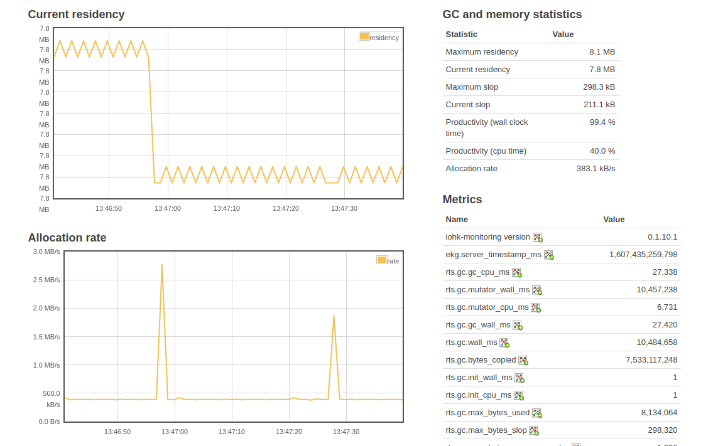

# EKG and Prometheus Metrics

It is possible to enable EKG and Prometheus monitoring on cardano-wallet server, by setting environment variables that configure ports and host names for those services:

```
CARDANO_WALLET_EKG_PORT
CARDANO_WALLET_PROMETHEUS_PORT

CARDANO_WALLET_EKG_HOST
CARDANO_WALLET_PROMETHEUS_HOST
```

```admonish warning
Monitoring is disabled by default. It is enabled by setting `CARDANO_WALLET_EKG_PORT` and/or `CARDANO_WALLET_PROMETHEUS_PORT` respectively.
```

### Enabling monitoring

To enable monitoring one can simply set environment variables with `cardano-wallet serve` command as follows:

```
> CARDANO_WALLET_EKG_PORT=8070 \
    CARDANO_WALLET_PROMETHEUS_PORT=8080 \
    cardano-wallet serve --port 8090 \
    --node-socket /path_to/cardano-node.socket \
    --mainnet \
    --database ./wallet-db
```

```admonish Note
In order to see EKG `GC and memory statistics` start wallet with
`cardano-wallet +RTS -T -RTS <other-args>`
```

Following the example above metrics would be available in `localhost` under corresponding ports:
 - EKG: http://localhost:8070



```
> curl -H "Accept: application/json" http://localhost:8070/ | jq

{
  "iohk-monitoring version": {
    "type": "l",
    "val": "0.1.10.1"
  },
  "ekg": {
    "server_timestamp_ms": {
      "type": "c",
      "val": 1606997751752
    }
  },
  "rts": {
    "gc": {
      "gc_cpu_ms": {
        "type": "c",
        "val": 0
      },
```

### Prometheus metrics

```
> curl http://localhost:8080/metrics

cardano_wallet_metrics_Stat_rtpriority_int 0
cardano_wallet_metrics_Stat_itrealvalue_int 0
rts_gc_par_max_bytes_copied 0
cardano_wallet_metrics_IO_syscr_int 3722
cardano_wallet_metrics_Stat_minflt_int 6731
cardano_wallet_metrics_Stat_cminflt_int 0
```

### Binding monitoring

By default both EKG and Prometheus monitoring is bound to `localhost` . One can bind it to different hostname or external ip using:

```
CARDANO_WALLET_EKG_HOST
CARDANO_WALLET_PROMETHEUS_HOST
```

For instance:

```
> CARDANO_WALLET_EKG_PORT=8070 \
    CARDANO_WALLET_PROMETHEUS_PORT=8080 \
    CARDANO_WALLET_EKG_HOST=0.0.0.0 \
    CARDANO_WALLET_PROMETHEUS_HOST=0.0.0.0 \
    cardano-wallet serve --port 8090 \
    --node-socket /path_to/cardano-node.socket \
    --mainnet \
    --database ./wallet-db
```
