## Transaction states

<p align="center">
  
</p>
<details>
  <summary>see diagram source</summary>


```hs
stateDiagram
  [*] --> pending: request
  [*] --> in_ledger: discover
  pending --> in_ledger: discover
  pending --> [*]: forget
  in_ledger --> pending: rollback

// Powered by https://mermaidjs.github.io
```
</details>

<br/>

:information_source: About `forget`

Importantly, a transaction, when sent, cannot be cancelled. One can only
request forgetting about it in order to try spending (concurrently) the same
UTxO in another transaction. But, the transaction may still show up later in a
block and therefore, appear in the wallet.

:information_source: About `discover`

Discovering a transaction happens regardless of a transaction being present
or not as `pending`. Actually, only outgoing transactions are going through 
the `pending` state. Incoming ones or, outgoing ones that have been forgotten
may be discovered directly in blocks.

## Submitting a transaction

<p align="center">
  
</p>

<details>
  <summary>see diagram source</summary>

```
sequenceDiagram
  participant Wallet Client
  participant Wallet Server
  participant Network

  Wallet Client ->>+ Wallet Server: POST payment request
  Wallet Server ->> Wallet Server: Select available coins
  Wallet Server ->> Wallet Server: Construct transaction
  Wallet Server ->> Wallet Server: Sign transaction
  Wallet Server -->> Wallet Client: 403 Forbidden
  Wallet Server ->>+ Network: Submit transaction

  Network ->> Network: Validate transaction structure
  Network -->> Wallet Server: (ERR) Malformed transaction
  Network ->>- Wallet Server: Accepted

  Wallet Server -->> Wallet Client: 500 Internal Server Error
  Wallet Server ->>- Wallet Client: 202 Accepted

  Network ->> Network: Broadcast transaction to peers
  loop Every block
      Network ->> Network: Insert or discard transaction(s)
      Network ->> Wallet Server: Yield new block
      Wallet Server ->> Wallet Server: Discover transaction(s)
  end

// Powered by https://mermaidjs.github.io
```
</details>
