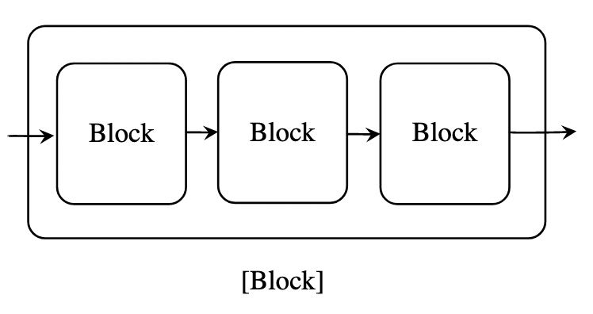

# "Light mode" for cardano-wallet
# Synopsis

This prototype explores whether we can implement a "light mode" for cardano-wallet which aims to make synchronisation faster by using a less trusted source for blockchain data.

**Result:**
Yes, the implementation of a "light mode" is feasible, but restricted to Shelley wallets. Importantly,

* Only *Shelley wallets* with sequential address derivation can be supported, as only these wallets will benefit from an efficient query "address → transactions". In contrast, Byron wallets have to inspect every single transaction on the chain.
* *Changes* to the current *code* are *modest*:
    * Different representation of a sequence of blocks in terms of a monadic query (`BlockSummary m`). A query for *address payment parts* may need to be added to cardano-graphql.
    * Different implementation of the `NetworkLayer` type.
    * Different implementation of stake pool data aggregation.
* Adaption to *Mithril* in the future will make some of these changes necessary anyway.
* The "light mode" *coexists* with the existing implementation, the wallet can still be operated with a local cardano-node if desired.
* *Synchronization time* of the "light mode" is estimated at < 1 minute on mainnet for a wallet with ~ 1'000 transactions; this is sufficient for casual users. By comparison, the status quo is ~ 50 minutes on mainnet for an empty wallet.

For details, see the "Results" section.

# Problem Statement

## Goal

This prototype explores whether we can implement a "light mode" for cardano-wallet where blockchain data is not retrieved from a cardano-node, but from a less trusted data source instead. This can speed up synchronisation to the blockchain network if the data source readily provides the most recent ledger state, so that we do not have to reconstruct this state from the blockchain history.

## Context

* *Currently*, cardano-wallet obtains blockchain data by retrieving all *blocks* of the chain from a local cardano-node.
* *Synchronizing* to mainnet by retrieving all blocks has become expensive. Benchmarks put us at ~ 50 minutes on mainnet for a wallet that does not contain any transactions.
* In the future, *Mithril* signatures will enable efficient snapshots of the blockchain with Proof-of-Stake-level of trust. Cardano-wallet will have to be adapated to work with this technology, which yields *ledger states*, but not individual *blocks*.
* Projects like [cardano-graphql][] also allow us to query the *ledger state*, albeit with a lower level of trust than Proof-of-Stake.
* In cardano-wallet, the data type `NetworkLayer` collects all functions necessary to gather blockchain data. Chances are that changes to the code are confined to providing a second implementation of this type.

  [cardano-graphql]: https://github.com/cardano-foundation/cardano-graphql/

## In-Scope

Questions to be answered with this prototype:

* What are the minimal changes that we need to apply in order to work with a ledger state as opposed to a sequence of blocks?
* Does the data source provide enough data so that we can implement all of `NetworkLayer`?
* Is the performance of the data source really competitive with the current status quo?

## Out-of-scope

Questions not to be answered here:

* Choice or implementation of the data source. For demonstration purposes, we pick [blockfrost.io][] to be our data source. It's based on cardano-db-sync.
* Type conversions. For this prototype, we use the data types provided in the API of the data source, which are not interchangeable with the types in cardano-wallet.
* Changes to the `cardano-wallet` REST API. We want to implement exactly the same API as before, just using a different data source.


# Results

In this section, we answer the "in-scope" questions posed above in detail.

## Ledger State vs. Sequence of Blocks

### Question

> What are the minimal changes that we need to apply in order to work with a ledger state as opposed to a sequence of blocks?

### Short answer

Implement a `BlockSummary` type that substitutes for a sequence of blocks `[Block]`. This type summarizes the data contain in the blocks via an efficient query `Address → Transactions`.

This solution works for sequential address discovery, e.g. Shelly-type wallets. Unfortunately, wallets with random address discovery, i.e. Byron-style, cannot be supported.

This prototype implements this idea and demonstrates that it is feasible.

A query may need to be *added to cardano-graphql* in order to ensure that only the *payment parts* of addresses are queried.

### Long answer

The main purposes of a wallet is to collect and summarize the *unspent transaction outputs (UTxO)* on the blockchain that the wallet is able to spend. Each UTxO belongs to an *address*; the wallet can spent the UTxO if it knows the secret key belonging to that address. In order to maintain some pseudoynmity, cardano-wallet manages a collection of different addresses rather than only a single address.

A *ledger state* typically provides an efficient query `Address → UTxO` which returns all unspent transaction outputs belonging to a given address. Usage of this query is the distinguishing feature of a *light wallet*, as this query is much faster than a full traversal of the entire history of *blocks* in the chain.

A ledger state only stores the *unspent* transaction outputs at a particular moment in time — *spent* transaction outputs are forgotten about. Some data sources go beyond storing just the ledger state, and instead provide an efficient query `Address → Transactions` that retrieves all transactions on the blockchain where the given address appears, spent or unspent. Such a query can be used to reconstruct the full *transaction history* of a wallet.

The current implementation of cardano-wallet expects blockchain data type be represented as a *sequence of blocks*, `[Block]`. Specifically, the `applyBlocks` function (in the module `Cardano.Wallet.Primitive.Model`) inspects each of the blocks and remembers any transaction which contains an address belonging to the wallet, while discarding all other transactions. However, this procedure yields essentially the same information as a `Address → Transactions` query, and it stands to reason that we can substitue the query for the sequence of blocks.

The *main idea* of this prototype is to performa a direct substitution, i.e. to replace the sequence of blocks `[Blocks]` by a more general type `BlockSummary` which still contains the information of interest, but represented in a different way. Specifically, we define

```haskell
data BlockSummary m = BlockSummary
    { from  :: ChainPoint
    , to    :: ChainPoint
    , query :: Address -> m [Transaction]
    }
```

If we visualize a sequence of blocks like this:



then we could visualize the BlockSummary like this:


Just like a sequence of blocks, a `BlockSummary` has a beginning (`from`) and an end (`to`); this is important to preserve all assumptions that the `applyBlocks` functions has about the blocks forming a sequence. However, the information contained in the blocks is filtered and summarized by a query function `Address → Transactions`. (This query returns *only* transactions in the inclusive range between `from` and `to`). Moreover, this query function is monadic, i.e. it can call out to the external data source.

The main question about the `BlockSummary` type is whether it really provides the necessary information in an efficient manner. Here, the main question is: Which addresses should be used as inputs to the query `Address → Transactions`? The wallet performs *address discovery*, which means that the collection of addresses managed by a wallet is not known in advance, but instead grows as blocks on the chain are traversed.

Fortunately, *sequential address discovery* (used for Shelley-style addresses) works with a sequence of potential addresses `addr_0`, `addr_1`, `addr_2`, … that belong to the wallet. For each integer `n`, there is a deterministic procedure for generating the corresponding address `addr_n`. However, we only generate the first few elements of the sequence, and generate more addresses when they are actually used in transactions on the blockchain. This scheme works well with the query, as we can query the sequence of addresses from the beginning.

Unfortunately, *random address discovery* (used for Byron-style addresses) cannot be adapated to work with the query `Address → Transactions`. The reason is that while testing whether a given address belongs to the wallet, there is no efficient way to generate a small sequence of candidate addresses to use with the query. A wallet with Byron-style addresses really has to inspect every address in every block, as that address could belong to the wallet.

### Comments

* To demonstrate that the above substitution is indeed feasible, the *prototype implements*

    * A function `lightSync` that maps the data from Blockfrost into `BlockSummary`.

    * A function `discoverTransactions` that implements sequential address discovery with `BlockSummary`.
    \
    (In order to be useable with `applyBlocks`, the transactions still need to be sorted by slot and index.)

* Using only the query `Address → Transactions` may not always be *efficient*. There is a trade-off:

    * When the wallet is not synchronized to the chain yet, there are many blocks in the chain, but few addresses in the wallet. In this case, the query beats traversing all blocks.

    * However, when the wallet contains many addresses and is synchronized close to the tip of the chain, traversing the next blocks may be more efficient than traversing all addresses again.

    * Fortunately, both schemes can be implemented, and selected dynamically, with the external data source.

* The `Address` on the blockchain includes both a *payment part* and a *staking part*. Ideally, we would be able to query the payment part, `PaymentAddress -> Transactions`. Otherwise, the sequential address discovery scheme needs to generate multiple staking parts as well, which drastically reduces efficiency. It appears that cardano-graphql does not yet support this query, though the tables in cardano-db-sync do.

* A transaction is relevant to the wallet iff it has relevant outputs, inputs, *withdrawals*, or *collateral*. While the query `Address → Transactions` does include outputs and inputs,

    * *withdrawal* addresses might not be included in the query. We may have to use a separate query `getAccountWithdrawals`.

    * *collateral* addresses might not be included in the query; we have to test this. Fortunately, this is low priority, as collateral is practically never spent.

* A *ledger state*, as provided by Mithril, will only give us outputs that are currently unspent — spent outputs are forgotten about. Even if we could query transactions from another source, it is *not* always possible to reconstruct the *transaction history* from this information: The wallet may contain history lines of transactions that never intersect with the current unspent outputs.

## NetworkLayer

### Question

> Does the data source provide enough data so that we can implement all of NetworkLayer?

### Answer

Yes, but.

The prototype goes through the relevant data types in detail, see the documentation for the module `Light`.

Notable "but"s:

* *Chain tip* needs to be watched by *polling*. 1 slot = 2 seconds seems like a good polling interval.
* *Transaction submission* provides *less notification* about rejection by node or network congestion.
* *Synchronization progress* cannot be displayed as a percentage, as total number of addresses cannot be known in advance.
* *Performance estimate* for *stake pools* requires nontrivial computations on likelihood estimates. Fortunately, we can steal the corresponding code from the ledger.
* *Stake pool registrations* currently detecting using sequence of blocks, `[Block]`, as well; "light mode" should use direct queries instead.

## Performance

### Question

> Is the performance of the data source really competitive with the current status quo?

### Short answer

Yes. Casual users should be able to synchronize their wallets in < 1 minute.

### Long answer

How much time does it take synchronize a wallet with 1'000 transactions? Probably < 1 minute:

Using the free [blockfrost.io][] service, I was able to retrieve the details for 100 transactions for one address in about 8 seconds. (This includes 100 HTTP queries for transaction details.) The time appears to scale linearly with the number of transactions. Thus, I estimate that 1'000 transactions take 80 seconds ~= 1 minute. That said, services like [cardanoscan.io][] appear to be able to show details for ~50 transactions in less than a second. Chances are that 1 minute is a substantial overestimate.

Which users are served well by wallets with 1'000 transactions? Casual users and even day traders:

According to FINRA rules, a user is considered a [pattern day trader if they execute 4 or more "day trades" within 5 business days][daytrader]. This would amount to a minimum of 200 transactions a year. Thus, casual users are unlikely to do more than 200 transactions per year if we include both regular shopping and finance (DeFi). However, usage may change in future — e.g. gaming or micropayments. 

 [blockfrost.io]: https://blockfrost.io/
 [cardanoscan.io]: https://cardanoscan.io/
 [daytrader]: https://www.finra.org/investors/learn-to-invest/advanced-investing/day-trading-margin-requirements-know-rules
