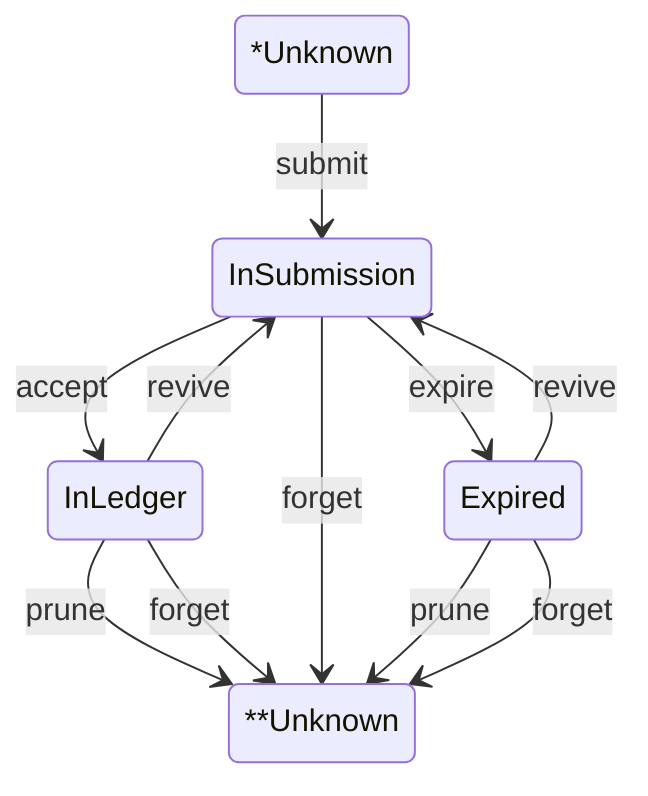
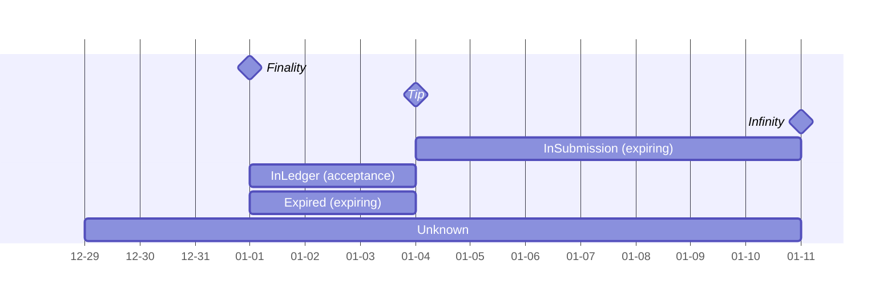

# Submissions database

# Synopsis 

The `Submissions` data structure tracks the life-cycle of transactions that are submitted to a decentralized ledger.

A typical use case looks like this: You create a new transaction, submit it to the dentralized ledger, and add it to the `Submissions` data structure through the `addSubmission` function, giving it the `InSubmission` status. You observe the decentralized ledger continuously and apply functions from the *Operations* group in order to handle rollforwards and rollbacks. Eventually, the transaction will move to status `InLedger` or `Expired`.

In order to limit the size of the database, the `Submissions` data structure also has a `finality` slot (the older endpoint of the _stability window_). Apply `moveFinality` to move this slot forward and discard those transactions whose status has become final.

# API: Observation

## Transaction status

Transactions are found in one of 4 statuses, reported by the `status` function:

- _Unknown_: Any transaction which the database does not know about. It's possible that the transaction was treated and submitted by this database, nevertheless no trace of it has been kept.
- _InSubmission_: Any transaction submitted by user that was not accepted on the blockchain and whose `expiration` slot is after the `tip` slot.
- _InLedger_: Any transaction accepted on the blockchain whose `acceptance` slot is before the `tip` and whose `acceptance` slot is after the `finality` slot.
- _Expired_: Any transaction that was not accepted on the blockchain before their `expiration` slot and whose `expiration` slot is before the `tip` slot and whose `expiration` slot is after the `finality` slot.

## Time

Time is expressed in `Slot`s. Slots are ordinals, with two relations:

- `before x y` = slot x is not strictly smaller than slot y
- `after x y` = slot x is bigger than slot y

Two absolute times are stored in the `Submissions` database:

- `tip`: Repesents the slot that governs state change between InSubmission and InLedger or Expired.
- `finality`: The slot that governs state change between Expired or InLedger and Unknown.

# API: Changes

## Status transitions

There are only few possible transitions between the statuses for each transaction. We will focus on slot positions to describe them.

1. _submit_: Usually triggered by constructing a new transaction to be submitted to the decentralized ledger for acceptance. This transition introduces the `expiration` slot for the transaction. Expiration must be after the current `tip` slot.
2. _accept_: Usually triggered by observing that the decentralized ledger has accepted a transaction that was *InSubmission*. This transition introduces the `acceptance` slot, which must be after the current tip and before `expiration`.
3. _expire_ : Triggered by the forward `tip` movement where the `tip` reaches the `expiration` slot of an *InSubmission* transaction — sending the transaction to the *Expired* status.
4. _revive_ : Triggered by a backward `tip` movement where the `tip` moves into the past of the `acceptance` slot of an *InLedger* transaction, or moves into the past of the `expiring` slot of an *Expired* transaction. This removes the `acceptance` slot and sends transactions back to *InSubmission*
4. _prune_ : Triggered by `finality` moving forward and moving past `acceptance` for *InLedger* or `expiration` for *Expired*, sending transactions to the *Unknown* status.
5. _forget_ : Triggered by a user who does not want to submit this transaction anymore. Any tracked transaction will go to *Unknown* status; *InLedger* transactions are forgotten as well in order to remove the chances that a tip rollback might bring them back to *InSubmission*. (In general, the operation of submitting a transaction to the decentralized ledger _cannot_ be undone, but we _can_ avoid resubmitting transaction that was not accepted; this is what _forget_ will achieve.)

## Status transition diagram

Note: The `Unknown` status is represented by both `*Unknown` and `**Unknown` for 
readability  

## Primitive Changes

The functions for changing the `Submissions` database are presented in two groups: *Primitives* and *Operations*.

The *Primitives* represent general changes to the database contents. They tend to be easier to implement as a database, but harder to use with rollforwards and rollbacks.

#### `addSubmission`

Try to add a previously `Unknown` transaction.

#### `moveToLedger`

Moves a transaction to `InLedger`.

#### `moveTip`

Moves the database `tip` forward or backward in time.

#### `moveFinality`

Moves the database `finality` forward in time.

#### `forget`

Remove a transaction from the database, whatever its status.

## Operation Changes

The *Operations* are a more specific set of changes that are tailored towards rollforwards and rollbacks. They are atomic compositions of *Primitives* that ensure 3 extensional laws:

### Laws

For all transactions statuses, let `slotObservation` be the slot obtained from the following table:

| status        | slotObservation       |
| ------------- | ---------- |
| InSubmission | expiration |
| InLedger     | acceptance |
| Expired       | expiration |

Then, the following laws must be respected for any composition of *Operations*:

1. The `tip` partitions the transactions into two groups: `InSubmissions`, and `InLedger` or `Expired` — through comparison with their `slotObservation`.
2. The `finality` partitions the transactions into two groups: pruned (`Unknown`), and `InLedger` or `Expired` — through comparison with their `slotObservation`.
3. The `finality` slot is always before the `tip`.

(Note: These laws do not need to hold when arbitrary sequences of *Primitives* are applied — but they do hold for arbitrary sequence of *Operations*.)

### Transaction timeline

For a `Submissions` database which was created through the application of *Operations* alone, and hence satisfies the laws above, we obtain a visual partition of the transactions by slot:

Note: Transactions with `Unknown` status cannot be partitioned by slot, we have to consider them through the entire timeline.