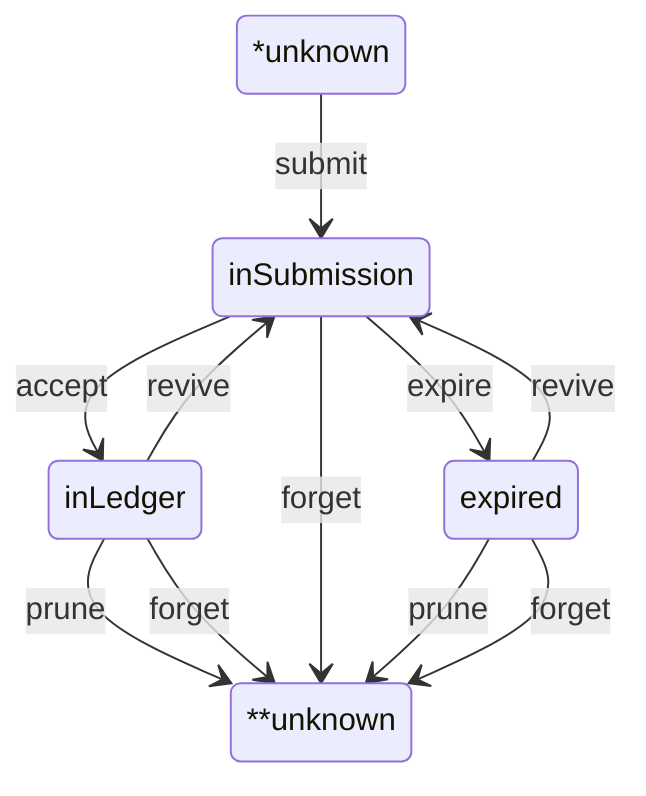

# Submissions store

## Synopsis 

Submissions is the store that keeps track of the life-cycle of submitted 
transactions. 

The store is limited in the past by what we called _finality_ 
slot (left point of _stability window_). This limitation is necessary if we want to keep the store in-memory during service time. The store will be backed by a `DBVar` and so it will be persistent.

## Transactions states

In the store transactions are found in 4 states

- _unknown_: any transaction for which the store cannot say anything. It's possible that the transaction was treated and submitted by this store, nevertheless no trace of it has been kept.
- _in-submission_: any transaction submitted by user that was not accepted on the blockchain and which `expiration` slot is after the `tip` slot.
- _in-ledger_: any transaction accepted on the blockchain whose `acceptance` slot is before the tip and whose `acceptance` slot is after the `finality` slot.
- _expired_: any transaction that was not accepted on the blockchain before their `expiration` slot and whose `expiration` slot is before the `tip` slot and whose `expiration` slot is after the `finality` slot

## Time

Relavant times are expressed in slots. Slots are ordinable, so we can express 2 relations
- before x y : slot x is not strictly smaller than slot y
- after x y : slot x is bigger than slot y

Two absolute times are stored in the store
- tip: repesents the slot that govern state change between in-submission and in-ledger or expired
- finality: the slot that govern state change between expired or in-ledger and unknown 

## State transitions

There are only some possible transitions between the states for each transaction. We will focus on slot positions to describe them.

1. _submit_: this is usually triggered by construction of a new transaction which was eventually submitted to a node for acceptance It introduces the `expiration` slot for the transaction. Expiration must be after the current `tip` slot
2. _accept_: this is usually triggered by the observation of the ledger where a transaction that was in-submission is noted in the the ledger.  It introduces the `acceptance` slot, which must be after the current tip and before `expiration`
3. _expire_ : this is triggered by the forward `tip` movement where the `tip` reaches the `expiration` slot of an *in-submission* transaction sending the transaction to *expired* state 
4. _revive_ : this is triggered by the back `tip` movement where the `tip` overcome the `acceptance` slot in the past of an *in-ledger* transaction, or overcome the `expiring` slot in the past of an *expired* transaction This removes the `acceptance` slot and send transactions to *in-submission*
4. _prune_ : this is triggered by `finality` moving forward and overcoming `acceptance` for *in-ledger* or `expiration` for *expired* sending transactions to *unknown* state
5. forget_ : this is triggered by user that do not want submit anymore Any tracked transaction will go to *unknown* state. In-ledger transaction are forgotten as well to remove the chances that a tip rollback bring them to re-submission

### Transition diagram
N.B. `unknown` state is represented by both `*unknown` and `**unknown` for 
readability  

### Primitives

Primitives are store changes that do not ensure the store is left in a 
consistent state. This means that consistency is generally obtained by some compositions of them. This is not then the store API. We decribe primitives here to better document their expected behaviors and help understand the API 
   
#### `add-submission`

Try to add an unknown transaction

#### `move-to-ledger`

Moves a transaction to in-ledger

#### `move-tip`

Moves the store tip forward or backward in time

#### `move-finality`

Moves the store finality forward int time

#### `forget`

Remove a transaction from the store, whatever its status

### Operations

Operations are a set of changes that represent the API to the submissions store. They are atomic composition of _primitives_ that ensure 3 extensionality laws.

#### Laws

Given the `slot-observation` for all known transactions

| status        | slot       |
| ------------- | ---------- |
| in-submission | expiration |
| in-ledger     | acceptance |
| expired       | expiration |

The following laws should be respected for any composition of the operations

1. store tip partitions via `slot-observation` in-submissions transactions from in-ledger or expired ones
2. store finality partitions via `slot-observation` pruned (unknown)transactions from in-ledger or expired ones 
3. finality is always before the tip

### Submissions store transactions layout

Once the operations law are fulfilled, we obtain the subsequent partition for the transactions known to the submission store

N.B. `unknown` status transactions cannot be time-partitioned by slot, we have to consider them all over time.