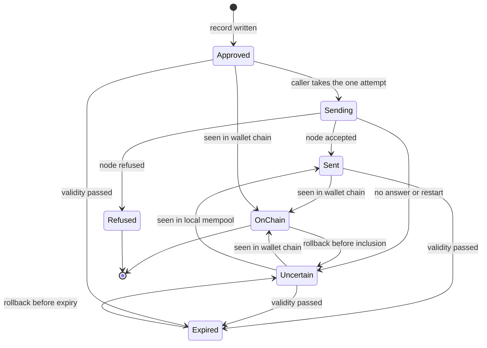
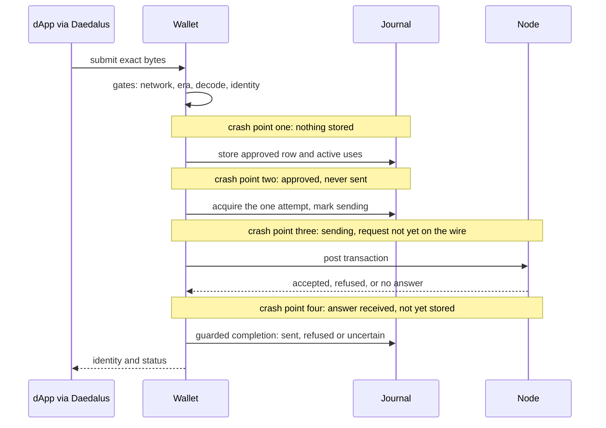
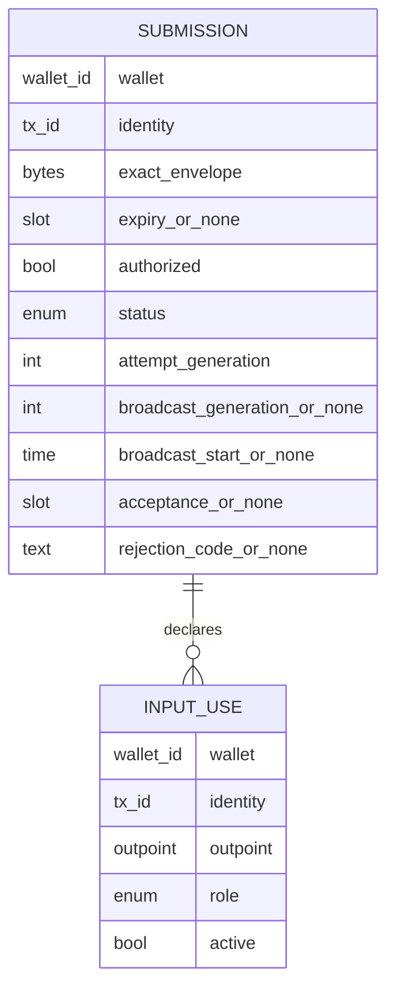

# Durable submissions: product specification

Draft, 2026-10-04, for
[#5461](https://github.com/cardano-foundation/cardano-wallet/issues/5461) within
[epic #5441](https://github.com/cardano-foundation/cardano-wallet/issues/5441).
It is derived from the epic, the specification ticket, the pinned pull requests
[#5446](https://github.com/cardano-foundation/cardano-wallet/pull/5446) at
`512e0ca9` and [#5453](https://github.com/cardano-foundation/cardano-wallet/pull/5453)
at `d71f3383`, the Daedalus connector branch, and the design discussion of
2026-10-04 whose decisions are listed in the decisions section. It states what
the product promises, in three registers for every clause: the sentence a user
can rely on, the predicate a model can state, and the check an implementation
must pass. Where no decision has been taken, the clause says so and names the
candidates. Nothing here is a verification result.

Every requirement carries its origin: **ruling** (a decision taken in the
design discussion and recorded in the decisions section), **ticket** (#5461
acceptance criterion), **promise** (epic, pull request or Daedalus text by its
author), **proposal** (this document) or **open** (needs a decision).

## Who this is for and what they get

A Daedalus user connects a dApp. The dApp builds a transaction, the user reviews
and signs it in Daedalus, and the dApp asks the wallet to submit it. From that
moment the user wants three things, and this specification is organised around
them:

1. **The wallet never crashes.** Whatever the node, the chain, a restart or a
   second dApp does, the wallet keeps running and keeps answering. Every
   situation the wallet can be put in has a defined outcome, and a refused
   action is a typed answer, not an exception.
2. **The wallet database has data invariants.** The record of submissions is
   well formed after every operation, after migration, and after a crash at any
   point, and a reader can check that on any database file.
3. **The user understands the limits and the recovery.** The wallet reports a
   small vocabulary of meanings, each with what it promises, what the user may
   do, what happens by itself, and what cannot be promised.

The first goal is a totality requirement on a state-by-event matrix. The second
is a well-formedness predicate that every transition preserves. The third is a
quotient of the raw internal states into public meanings. The sections below
build those three objects from the scenario corpus the design discussion settled on.

## What the sources promise today

The sources inspected on 2026-10-04 contain these user-facing commitments. They
are the inputs this specification refines; they are not yet accepted
requirements unless marked as a ruling or a ticket criterion.

| Source | Promise, in its own terms | Origin |
| --- | --- | --- |
| Epic #5441, story five | The wallet "submits transactions with durable wallet state" | promise |
| User-story expansion of the epic, 2026-09-22 (https://gist.github.com/paolino/af1f51dfe05b041c1903a4fe8b3be0a1) | As a Daedalus user, "I want a submitted transaction recorded durably and wallet-scoped before it goes to the node, so that a crash between submit and record cannot lose track of my funds or double-spend my UTxO"; the submission-failed and submission-unavailable errors are distinct because "a rejected transaction and an unreachable node are not the same event to a client" | derived from the original branch code, not an accepted contract |
| Capability endpoint, same expansion | Daedalus enables the dApp backend only when the wallet advertises exactly four capabilities at revision one, among them `durable-wallet-submit`, on a Conway node; a partial backend is refused rather than degraded | promise |
| Context token, same expansion | A reviewed context is signed with a per-process key, so a wallet restart invalidates every review in flight and the dApp must request a fresh context before signing | promise |
| Epic #5441, story six | The wallet "preserves preferred collateral during ordinary wallet operations" | promise |
| Epic #5441, completion criteria | "Make binding, network, passphrase, conflict, and race failures safe"; complete the read, review, sign and submit journey on a disposable cluster | promise |
| Andrew's epic follow-up, 2026-09-29 | Unsupported node and transaction era combinations "must fail explicitly, without an exception or a misleading context conflict" | promise |
| Submission endpoint description, PR #5453 | "Durably records the exact envelope before contacting the local node. Exact replays return the existing identity" | promise |
| Submission handler, PR #5453 | A rejected or expired row answers with the fixed error "Transaction submission failed"; every other status answers 200 with the status name | promise |
| Watcher comment, PR #5453 | "This function never calls postSealedTx. In particular, opening a wallet cannot turn a durable authorized transaction into a network submission" | promise |
| Collateral preference, PR #5454 | Preferred collateral is excluded first and retried from the full UTxO set if needed; "this preference does not lock funds" | promise |
| Review of PR #5446 (https://gist.github.com/paolino/e2a55c82649fcdf3f67047c954285230) | A contested rollback must complete, keep both submissions as evidence, leave the contested outpoint with its current owner, re-reserve the reverted row's uncontested inputs, and not rebroadcast automatically | proposal, adopted by the design discussion |
| Ticket #5461 | Rollback revives in-ledger and expired rows, preserves authorization, is total; migration is total over any legacy pool; one active claim per wallet and outpoint | ticket, the last criterion contested by a ruling |
| Design discussion | No transaction priority; collateral-only sharing admitted; roles belong to uses; rollback reconciles submissions, pending rows included | ruling |
| Daedalus connector requirements, branch `amw/cip30` of input-output-hk/daedalus at commit 065a4812 (https://github.com/input-output-hk/daedalus/blob/065a4812292c28fba0b9c0222f51ba9d32d90013/.agent/plans/dapp-browser-cip30/dapp-browser-cip30-prd.md) | "Every submission call receives its own confirmation; signing does not grant an automatic submission waiver"; submission is "a point of no return once the user gives explicit confirmation"; the wallet's pending submission state is "the sole durable submission record"; startup never submits a transaction that was only signed; "dApps may retry idempotently" | promise, client side |
| Daedalus connector code, same commit | One submission request per approval, never repeated, never polled; status afterwards comes from the ordinary transaction history every five seconds; receipts survive a Daedalus restart; no cancel after approval, no retry button, "Done" dismisses the receipt | promise, client side |

The current channel to the user is narrower than the wallet's surface suggests.
The wallet exposes no read endpoint for a submission: a dApp could learn the
status from the answer to its request, by repeating the exact same request, or
from the pending overlay of the transaction-context endpoint, whose schema
allows exactly one state value, `outcome_unknown`, for every pending row. The
Daedalus connector uses only the first: it sends once, then watches the
ordinary transaction history. The legacy projection is therefore the product
surface the user actually looks at, and this specification treats it as one.
The Daedalus dialogs are described below as evidence of the intended
experience; their wording is Daedalus's to change.

## Public meanings: what the user is told

The seven internal statuses are implementation vocabulary. The user needs fewer,
sharper meanings, each with a stable promise. The diagram shows the proposed
public meanings and what moves a submission between them.

The two revival arrows out of on-chain and expired are the ruled direction, not
the captured machine: the captured machine revives an on-chain row into the
sent meaning and never revives an expired row. Which revived meaning the user
sees is an open ruling discussed below.

For each meaning, five fields: what the user sees, what
they may do, what the wallet does by itself, what funds remain available, and
what can happen next.

| Meaning | Internal states | Promise to the user | User may | Wallet does by itself | Funds | Next |
| --- | --- | --- | --- | --- | --- | --- |
| **Approved, not sent** | `Authorized` | Consent and exact bytes are stored. Nothing has been sent. | Repeat the exact request to send it. Nothing else. | Watches the chain only; never sends on its own. | Inputs and collateral reserved from this wallet's own selection. | Sending, expired, or on chain if the same bytes reached the network another way. |
| **Sending** | `Broadcasting` | One attempt is in flight, for at most the attempt timeout. | Wait. A repeated request returns this meaning without a second attempt. | Completes the attempt or gives up into uncertain. | Reserved. | Sent, refused or uncertain. |
| **Sent, awaiting the chain** | `Submitted` | A node accepted the transaction, or it was seen in the local mempool. Inclusion is not promised. | Wait. Repeating the request changes nothing. | Watches for inclusion or expiry. | Reserved. | On chain, expired, or uncertain after a rollback. |
| **Outcome uncertain** | `OutcomeUnknown`, any origin | The wallet does not know whether the network has the transaction. It will not try again by itself. | Wait, or build a replacement transaction. Repeating the request changes nothing. | Watches for inclusion, mempool presence or expiry. | Reserved while the row holds active uses; see the open rulings for the rollback-conflict and migrated cases. | Sent, on chain or expired. Without an expiry this can last forever. |
| **On chain** | `InLedger` with acceptance slot | Included in the wallet's current chain at the recorded slot. A rollback can undo this. | Nothing. | Watches for a rollback. | Released. | Uncertain after a rollback deeper than the acceptance slot. |
| **Refused by the node** | `Rejected` | The local node refused this exact transaction. | Build a replacement transaction. This transaction identity cannot be retried through this wallet. | Nothing further; the row is no longer watched. | Released. | Final in the captured machine, even if the same bytes later reach the chain by another route. |
| **Expired** | `Expired` | The validity interval passed without inclusion in the wallet's chain. | Build a replacement transaction. | Watches nothing further in the captured machine. | Released. | Final in the captured machine; the ruled direction is revival on a rollback before expiry. |

Open ruling on vocabulary: whether sent and uncertain stay distinct meanings.
They offer the same actions, and differ only in evidence: sent carries a node
acceptance or a mempool sighting, uncertain carries neither. The recommendation
is to keep them distinct, because the evidence difference is exactly what the
user asks about after a timeout, and because the revived meaning after rollback
must then be uncertain, which is the honest one.

### How the meanings reach the user

| Channel | Carries | Note |
| --- | --- | --- |
| Answer to the submission request | Transaction identity and one of seven status names, or a fixed error | Refused and expired rows answer with the error "Transaction submission failed" and no status; the dApp cannot tell them apart from that answer alone. |
| Repeating the exact request | Same as above, for the stored row | The wallet's only poll channel. No second network attempt unless the row is still approved and unsent. The Daedalus connector never uses it. |
| Transaction-context pending overlay | Pending rows with their inputs, collateral and expiry, all under the single state `outcome_unknown` | Daedalus uses it to re-check the context and to label preferred collateral as in use; it is not shown to the user. Which internal statuses are included is to be confirmed against the overlay producer. |
| Ordinary transaction listing | The legacy projection: pending, in ledger or expired; refused rows are absent | The channel Daedalus refreshes every five seconds and the user watches. Loses the approved, sending, uncertain and refused distinctions. |

### What Daedalus shows for each answer

Read from the connector code at the pinned commit, not run. The dApp receives
the CIP-30 result; the user sees the dialog; the receipt is what the history
view keeps.

| Wallet answer | The dApp receives | The user sees | Receipt |
| --- | --- | --- | --- |
| Status sent or on chain | the transaction identity | "Transaction submitted", later "Transaction confirmed" when the history shows it on chain | pending, then confirmed |
| Status approved, sending or uncertain | the transaction identity, as a success | "Submission status unknown. Check your transaction history before trying again to avoid duplicate payments or additional fees." | submission unknown |
| Fixed error "Transaction submission failed", which is how the wallet reports refused and expired | a send failure | "Submission status unknown", the same dialog as above | submission unknown |
| Fixed errors for invalid request, identity conflict, unavailable submission, or any error code Daedalus does not expect on this call | an internal error | "Submission status unknown" | submission unknown |

Two consequences for this specification. A definite refusal by the node reaches
the user as "status unknown", and because refused rows are absent from the
history projection, the receipt stays unknown for good: the user is told to
check a history that will never mention the transaction. And the approved,
sending and uncertain statuses are all success to the dApp, so the dApp's own
retry policy, which the Daedalus requirements expect to be idempotent, is the
only thing that distinguishes them. Both are recorded as open rulings below.

## Supported actions and their refusals

Every action the wallet offers has a defined result, and every action it does
not offer has a defined refusal. A refusal is a typed answer; a transaction
failure is a status. The two are never conflated.

| Action | Precondition | Result | Refusal when the precondition fails | Origin |
| --- | --- | --- | --- | --- |
| Submit a new transaction | Configured network matches; node era supported; bytes decode and agree with the identity; no outpoint in both roles in one request; no refusing overlap with an unresolved row | Row stored as approved before any network call, then this caller takes the one attempt and receives the resulting status | Fixed errors: invalid request, account changed, unsupported era, identity conflict for overlap, submission unavailable | promise |
| Repeat the exact request | Same wallet, identity, bytes and inputs | The stored status. If still approved and unsent, this caller may take the first attempt | Not applicable | promise |
| Repeat with different bytes under the same identity | Never satisfied | Identity conflict; the stored row is untouched | Always refused | promise |
| Cancel a submission | Not offered | Not offered | No endpoint; a sent transaction cannot be recalled | proposal: keep it unoffered and say so |
| Retry a refused or expired identity | Not offered | Not offered | Repeating the request returns the same fixed error without a network call | open: see rulings |
| Dismiss a stale row from the user's view | Not offered | Not offered | None; the row stays until the chain or expiry settles it | open: see rulings |
| Use an unresolved row's inputs in a new wallet transaction | Refused for ordinary spends by the wallet's own coin selection through the pending overlay | New transaction avoids them | Not a refusal to the user; the inputs are simply unavailable | promise, with the collateral case open |

Overlap refusal policy on admission, per outpoint and per role, relative to an
unresolved row:

| Existing use | New use | Admission on this overlap alone | Origin |
| --- | --- | --- | --- |
| Collateral | Collateral | Allowed | ruling |
| Ordinary spend | Ordinary spend | Refused | proposal |
| Ordinary spend | Collateral | Refused | proposal |
| Collateral | Ordinary spend | Refused | proposal |

The captured machine refuses all four. The first row is a settled change; the
other three await a ruling.

## Goal one: every event has an outcome

### The event alphabet

These are the events the journal must answer. Anything outside the list is
outside the model and must be named as such.

- **Caller events.** A new request for an unknown identity. An exact repeat of a
  known identity. A repeat with different bytes under a known identity. The
  caller's attempt acquisition that follows an approved row.
- **Node events.** The node accepts the attempt. The node refuses it. The
  attempt ends without an answer: an exception or the attempt timeout.
- **Process events.** The wallet process restarts while a row is in any state.
- **Observation events**, taken only when the wallet has a checkpoint at the
  node's sampled point, with up to three samples when the tip moves: the
  transaction is in the wallet's chain; it is in the local mempool; it is absent
  and its expiry is strictly below the tip; it is absent and not expired; the
  observation is unavailable.
- **Chain events.** A rollback to the checkpoint the database actually chose,
  which may be shallower than requested.
- **Storage events.** Opening a database at schema version five triggers the
  migration. Opening a corrupt or unwritable file.

### The state-by-event matrix

Rows are the internal statuses, with their relevant sub-cases. A cell names the
captured outcome and, in bold, whether the outcome is **settled**, **contested**
by a ruling or ticket criterion, or a **hole** with no defined outcome. Edge
identifiers in parentheses refer to the edge legend at the end of this
document, which names each captured transition with its source lines.

Caller and node events:

| Status | New request | Exact repeat | Changed repeat | Attempt acquisition | Node accepts | Node refuses | No answer |
| --- | --- | --- | --- | --- | --- | --- | --- |
| no row | gates, then stored as approved with active uses (E01 to E04); refused on overlap, **contested** for collateral-only overlap | not applicable | not applicable | not applicable | stale result ignored (E11), **settled** | same | same |
| approved | not applicable | row returned; caller may acquire (E05), **settled** | identity conflict (E06), **settled** | becomes sending if authorized and generation matches, else actual row returned (E07), **settled** | ignored unless predecessor matches, **settled** | same | same |
| sending | not applicable | row returned, no attempt (E05) | identity conflict | acquisition fails, actual row (E07) | sent (E08), **settled** | refused, consent cleared, uses released (E09), **settled** | uncertain, uses kept (E10), **settled** |
| sent | not applicable | row returned, no attempt | identity conflict | fails | stale, ignored | stale, ignored | stale, ignored |
| uncertain | not applicable | row returned, no attempt: an unknown outcome is not permission to retry, **settled** | identity conflict | fails | stale, ignored | stale, ignored | stale, ignored |
| refused | not applicable | fixed error, no attempt, **settled as captured, open as policy** | identity conflict | fails | stale, ignored | stale, ignored | stale, ignored |
| expired | not applicable | fixed error, no attempt | identity conflict | fails | stale, ignored | stale, ignored | stale, ignored |
| on chain | not applicable | row returned | identity conflict | fails | stale, ignored | stale, ignored | stale, ignored |

Process, observation and chain events:

| Status | Restart | Seen on chain | Seen in mempool | Absent, expired | Absent, not expired | Unavailable | Rollback before the relevant slot |
| --- | --- | --- | --- | --- | --- | --- | --- |
| approved | unchanged; never sent by the watcher (E12 scope), **settled, with a user-experience question** | on chain, consent cleared, uses released (E14) | sent, consent cleared (E15) | expired, uses released (E16) | unchanged (E23) | unchanged (E13) | unchanged; **contested**: the ruling says pending rows are reconciled |
| sending | uncertain, attempt start cleared, no second attempt (E12), **settled** | not watched | not watched | not watched | not watched | not watched | unchanged; late result may still apply, **contested** |
| sent | unchanged | on chain (E14) | unchanged (E15 excludes sent) | expired (E16) | unchanged: local absence is not rejection (E23), **settled** | unchanged | unchanged, **contested** |
| uncertain, from an attempt | unchanged | on chain | sent, consent cleared | expired | unchanged | unchanged | unchanged, **contested** |
| uncertain, from a rollback conflict | unchanged | on chain | sent | expired | sent, then use restoration may send it straight back to this state (E17 then E19): an oscillation, **hole** | unchanged | unchanged |
| refused | unchanged | **hole**: not watched, so a refusal that nonetheless lands is never recorded | not watched | not watched | not watched | not watched | unchanged |
| expired | unchanged | **hole**: not watched | not watched | not watched | not watched | not watched | unchanged although expiry is after the target: **contested** by the ticket |
| on chain | unchanged | acceptance refreshed | sent, acceptance cleared, consent cleared (E15) | expired (E16 before E17) | sent, consent cleared, uses restored or conflict (E17, E19) | unchanged | sent, consent **set to true**, uses restored or rollback conflict (E18, E19): **contested** by the ticket; in the earlier version the conflict threw and the rollback failed (E20): a **crash cell** |

Observations about the matrix as a whole:

- **The matrix is total except for the throwing rollback of the earlier
  version.** Every other cell has a captured outcome. Goal one is therefore
  mostly a matter of keeping the typed-outcome discipline the later version
  already has, and of resolving the contested cells by ruling rather than by
  patching.
- **Two revival paths disagree.** A row leaves the on-chain meaning either
  because the wallet rolled back or because the node no longer shows it. The
  first path sets consent to true; the second clears it. The ticket requires
  neither to touch consent.
- **The expiry boundary disagrees with the legacy store.** The watcher expires
  a row only when the tip is strictly past the expiry slot; the legacy store
  expires at the expiry slot itself. One convention must be chosen and the
  other projected.
- **Two rows are never watched again.** Refused and expired rows leave the
  observation set. If the same bytes reach the chain anyway, the ordinary
  wallet history shows the transaction while the journal still says refused.
  The user sees two answers.
- **The client widens the user base.** The Daedalus branch also sends native
  Ledger and Trezor payments through the same endpoint, and offers "sign and
  submit" for a dApp signing request. The journal's user is therefore any
  Daedalus user, not only one using a dApp, and the matrix applies to them too.

### Crash points

The sequence below is one submission with the four places a crash can land.
The journal rule that makes every one of them safe is "persist before dispatch".

| Crash point | What is on disk | What the user sees after reopening | What they may do | Origin |
| --- | --- | --- | --- | --- |
| One, before the row is stored | Nothing | No record; the dApp got no answer | Repeat the request; it is treated as new | promise |
| Two, after the row, before the attempt | Approved row with active uses | Approved, not sent; funds reserved | Repeat the exact request to send it; nothing happens otherwise | promise, with the user-experience question below |
| Three, after acquisition, before the wire | Sending row | Uncertain, although nothing was sent | Wait or build a replacement; the identity cannot be sent again | promise: honest but pessimistic |
| Four, after the answer, before storing it | Sending row | Uncertain, although the node may have accepted it | Wait; the watcher will see it on chain or in the mempool | promise |

The approved-but-unsent case deserves a decision. A dApp that crashed Daedalus
between consent and dispatch leaves a reservation that only an exact repeat can
release into a send, and only expiry or a replacement can otherwise clear. The
options are to keep it, to let the watcher take the first attempt on behalf of
the original caller, or to let an expiry-less approved row age out. The first
is the captured behaviour and the promise that opening a wallet never sends.

### Failures outside the semantic model

| Failure | Required behaviour | Origin |
| --- | --- | --- |
| Node unreachable during the attempt | Uncertain outcome, no retry by the wallet | promise |
| Node unreachable during observation | Rows unchanged; the wallet keeps serving | promise |
| Disk or I/O error while writing the journal | The request fails with the fixed unavailable error; the journal is unchanged because every change is one database transaction | proposal, to confirm against the store |
| Migration finds corrupt bytes or a mismatching identity | Migration aborts and the source is unchanged | promise |
| What the wallet does after an aborted migration | **Open.** The pinned code aborts the migration transaction; whether the wallet then opens was not captured. From the user's seat a wallet that will not open is a crash. Candidates: open with the journal quarantined and the legacy pool read-only, or refuse to open with a stated reason and a documented recovery. | open |

## Goal two: the database is always well formed

The journal is two tables. The predicate below is stated over a snapshot of
them together with the wallet's current checkpoint, independently of how the
snapshot was reached. Every transition in the matrix must preserve it,
migration must establish it, and a wallet command must be able to check it on a
database file found in the wild. That command is the only way a data invariant
reaches a user.

Each clause names its enforcement level: **schema** when a constraint in the
database refuses the violation, **transaction** when the application's atomic
operation refuses it, **check** when only a reader can detect it. Ticket #5461
authorises no schema change, so most clauses are check-level for now; the check
still runs against the real store, on fresh and on migrated databases.

| Clause, per row | Enforcement today | Origin | Known violation in the captured machine |
| --- | --- | --- | --- |
| The identity equals the hash of the stored bytes | transaction at admission; migration checks live rows only | promise | Migrated terminal rows are copied unchecked |
| Attempt start and broadcast generation are present exactly while sending | transaction | proposal | None found |
| Acceptance is present exactly when on chain, and never above the current tip | transaction and rollback | proposal | None found |
| A rejection code is present only on refused rows and on uncertain rows born of a rollback conflict | transaction | promise | None found |
| Consent only ever moves from true to false | none | ticket: rollback preserves authorization | Wallet rollback sets it to true (E18) |
| The attempt generation never decreases, and is never reset by repeat, rollback or restart | transaction | promise | None found |
| Expiry is immutable for the life of the row, and absent expiry means never | transaction | promise | Representation of absent expiry to confirm |
| No expired row has an expiry above the current tip | none | ticket: rollback revives expired | Rollback never revives expired rows |
| No row is on chain with acceptance above the current tip | rollback | ticket | None found |

| Clause, across rows | Enforcement today | Origin | Known violation in the captured machine |
| --- | --- | --- | --- |
| The input-use rows of a submission are exactly the ordinary and collateral inputs decoded from its bytes, with their roles; reference inputs have no row | transaction at admission | promise | Migration creates no input rows for in-ledger and expired legacy rows, which a rollback may revive |
| A use is active exactly when its submission is unresolved: approved, sending, sent or uncertain | transaction | promise | Uncertain rows born of a rollback conflict are unresolved with inactive uses; migrated pending rows are active |
| Among active uses of one outpoint in one wallet: any number of collateral uses | schema refuses it today | ruling | The unique index and the admission lookup refuse the second collateral use |
| Among active uses of one outpoint in one wallet: at most one ordinary spend | schema on migrated databases, transaction on fresh ones | proposal | Fresh databases lack the index; schema differs between fresh and migrated wallets |
| No outpoint has both an active ordinary spend and an active collateral use | schema today | proposal | None, under the current blanket rule |
| Rows and uses are scoped by wallet; the same identity in two wallets is two rows | schema | promise | None found |
| After a coherent observation, a journal row is on chain exactly when the ordinary wallet history shows its transaction | none | proposal, an eventual property | Refused and expired rows are never re-observed |

The second table's third and fourth clauses are the replacement for the
ticket's blanket "at most one active claim per wallet and outpoint", which the
collateral ruling retires. The ticket text needs an explicit amendment
before this table can be called the ticket's.

Preservation is stated per transition: for every cell of the matrix, if the
predicate holds before, it holds after. Migration is stated as establishment:
for every well-formed legacy pool, the predicate holds on the result. The
executable form is a well-formedness check run after every step of a generated
trace, on the reference model and through the adapter on the store.

## Goal three: what the wallet cannot promise

These sentences belong in the user documentation shipped with the feature,
once, in this form.

- A transaction that has been sent cannot be cancelled by the wallet. The
  wallet can only stop reserving its inputs.
- Absence from the local node's mempool does not mean absence from the
  network. The wallet never concludes rejection from local absence.
- When two transactions overlap, the wallet does not choose which one the
  network includes and does not promise an order.
- A transaction with no expiry can stay uncertain forever if the network
  neither includes nor shows it.
- A transaction shown as on chain can be undone by a rollback and return to
  uncertain. Its inputs become reserved again.
- A transaction the node refused is final for that identity in this wallet.
  A corrected transaction is a new identity.
- A reservation protects only this wallet's own future transactions. Another
  wallet, or a dApp holding the same keys, can still spend the inputs.
- After a restart during sending, the wallet reports uncertain even when
  nothing reached the node, because it cannot tell the difference.
- A wallet restart invalidates every reviewed context that has not been
  signed yet. The dApp must ask for a fresh context; nothing the user already
  approved is signed from a stale one. A submission already recorded is not
  affected: it survives the restart in the journal.

## Rollback and migration contracts

Rollback, for the checkpoint the database actually chose, at slot T:

| Rule | Captured | Ruled or required | Origin |
| --- | --- | --- | --- |
| On-chain rows accepted after T leave the on-chain meaning; acceptance cleared | yes, to sent | to the revived meaning chosen by ruling | ticket |
| Expired rows with expiry after T are revived | no | yes | ticket |
| Rows accepted or expired exactly at T are untouched | yes for acceptance; expiry not applicable | yes | design discussion |
| Consent, identity, bytes, expiry, input evidence and attempt metadata are preserved | consent is set to true | preserved | ticket |
| Pending rows are reconciled: eligibility invalidated or prior state restored | untouched | reconciled | ruling |
| Uses of a revived row are restored unless another unresolved row holds one; then the row is uncertain with a rollback-conflict code and no active uses | yes, in the later version | the review asks for uncontested uses to be restored even when one is contested | proposal |
| A late node result based on the discarded chain context does not restore eligibility | applies if the row was untouched | must not | ruling |
| No overlap causes an error or a deletion; repeating the rollback changes nothing | later version yes; earlier version throws | yes | ticket |

Migration, from schema version five:

| Rule | Captured | Required | Origin |
| --- | --- | --- | --- |
| Every row keeps wallet, identity, bytes, expiry and acceptance | yes | yes | ticket |
| Pending maps to uncertain, in ledger to on chain, expired to expired | yes | yes | promise |
| Consent false, generation zero, attempt and rejection metadata absent | yes | yes | promise |
| Input evidence is recovered for every status, including rows a rollback can revive | live rows only | every status | ticket, through revival |
| Overlapping pending rows migrate; shared collateral is admitted | aborts on any overlap | migrates; ordinary-spend overlap policy open | ruling for collateral |
| Corrupt bytes or mismatching identity abort with the source unchanged | yes | yes, with the wallet's behaviour afterwards still open | promise |

The user-visible outcome of migration is a sentence the user documentation must
contain: after the upgrade, every transaction that was pending appears as
uncertain, with its inputs reserved, and no transaction is sent by the upgrade.

## Decisions

Settled decisions, each with the alternative it rejected.

| Decision | Chosen | Rejected | Why | Origin |
| --- | --- | --- | --- | --- |
| Order between overlapping transactions | None; record overlap and actual outcomes | First submitted wins; incumbent wins; identity order | The wallet cannot impose an order on the network | ruling |
| Shared collateral | Any number of concurrent collateral uses admitted | One active claim per outpoint regardless of role | Successful scripts do not consume collateral; refusing is a false conflict | ruling |
| Where a role lives | On a transaction's use of an outpoint | A flag on the outpoint | The same outpoint is collateral for one transaction and a spend for another | ruling |
| Rollback and submissions | Rollback reconciles every submission, pending rows included | Keep pre-rollback eligibility | Eligibility was established against a chain that no longer exists | ruling |
| Order of work | Assess the captured machine first, then amend | Amend the machine in place | A property the original violates must be kept with its witness | ruling |
| When the record is written | Before the network attempt | After node acceptance | Survives a crash at any point; replay is classifiable | promise |
| Who sends | The caller that recorded consent, once | The watcher resends pending rows every few blocks | A dApp transaction must never be sent without the request that authorised it | promise |
| Refusal versus failure | Typed fixed errors for refused actions; statuses for transaction outcomes | Exceptions; one error for everything | The user must tell "you may not" from "it did not work" | promise |

Open rulings, in dependency order, each with a recommendation. A
recommendation is not a decision.

| Question | Candidates | Recommendation |
| --- | --- | --- |
| Which meaning does a revived row take | Sent; uncertain | Uncertain: the wallet has no fresh node acceptance to report |
| Admission of ordinary-spend overlap and mixed-role overlap | Refuse all three; admit with a warning; admit | Refuse all three; the pending overlay already hides them from the wallet's own selection |
| Reserved funds of an uncertain row born of a rollback conflict, and of migrated pending rows | No active uses; uncontested uses active; all uses active | Uncontested uses active, as the review asks; the contested one stays with its current owner |
| Historical ordinary-spend overlap after a rollback before an expiry | Both rows uncertain with a conflict code; both sent; refuse the rollback | Both uncertain with the conflict code; neither is chosen; the chain decides |
| Approved but never sent | Keep until repeat or expiry; watcher takes the first attempt; expiry-less rows age out | Keep, and document it; sending without the caller breaks the one-sender promise |
| Retry of a refused identity | Never; allowed after a node restart; allowed once | Never, and say so; a refusal with a transient cause is still a refusal of those bytes |
| Watching refused and expired rows | Never; until expiry; always | Until expiry, so a refusal that lands is recorded on chain rather than contradicted by the history |
| Expiry boundary | Expire when the tip passes the expiry slot; expire at the slot | Match the legacy store at the slot, and project consistently |
| How a refused or expired row answers the submission request | The fixed error with no status, as captured; a 200 answer with the status name | The status name: it is a definite outcome, the connector already has a "Transaction failed" dialog for it, and the fixed error makes it indistinguishable from an unreachable wallet |
| Refused rows in the history projection | Absent, as captured; shown as expired; shown with a failed status the connector already understands | Shown as failed: the history is the only channel the user watches, and a receipt that can never resolve is the worst outcome for goal three |
| The wallet after an aborted migration | Refuse to open with a reason; open with the journal quarantined | Open with the legacy pool read-only and the journal empty, so the user keeps their wallet and the recovery is documented |
| Public vocabulary | Seven names; the meanings above; fewer | The meanings above, with sent and uncertain distinct |

## Traceability

Each clause of this specification maps to the authority behind it, the public
meaning it protects, the invariant clause it preserves, and the property name
the design discussion already lists where one exists. The evidence column is
the state on 2026-10-04: no executable model, Lean statement or Haskell
property has been produced yet.

| Clause | Authority | Public meaning | Invariant | Property | Evidence |
| --- | --- | --- | --- | --- | --- |
| Record before dispatch; exact repeat classifies from the record | promise | approved; sending | identity; generation | `exact_replay_preserves_state`, `identity_conflict_preserves_state` | none yet |
| One acquisition per attempt; no second dispatch on repeat, restart or uncertainty | promise | sending; uncertain | generation never decreases | `broadcast_attempt_is_acquired_once`, `broadcast_requires_authorization_and_generation` | restart case run manually by the author, not reproduced |
| A stale completion never overwrites newer state | promise | all | field consistency | `stale_results_do_not_restore_eligibility` | unit tests in the submission PR, not rerun |
| Collateral-only overlap admitted, lifecycle unchanged | ruling | approved | any number of collateral uses | `collateral_sharing_is_admitted`, `collateral_sharing_preserves_lifecycle` | refused by the captured machine |
| Input roles define required outpoints; references reserve nothing | promise | approved | uses equal decoded inputs | `input_roles_define_required_outpoints`, `input_usage_matches_evidence` | none yet |
| Settling a row releases only its own uses | promise | on chain; refused; expired | active iff unresolved | `settled_rows_release_their_input_usage`, `remaining_input_users_are_preserved` | none yet |
| Overlap is symmetric and never blocks recording an actual inclusion | ruling | on chain | history agreement | `overlap_is_symmetric`, `overlap_does_not_prevent_observed_inclusion` | none yet |
| Rollback revives on-chain rows accepted after the target | ticket | on chain to revived | acceptance below tip | `rollback_revives_in_ledger` | captured, with consent defect |
| Rollback revives expired rows with expiry after the target | ticket | expired to revived | no expired row above tip | `rollback_revives_expired` | violated by the captured machine |
| Rollback preserves consent, evidence and attempt metadata | ticket | all | consent monotone | `rollback_preserves_authorization`, `rollback_preserves_evidence`, `rollback_preserves_attempt_metadata` | consent violated by the captured machine |
| Rollback leaves rows at the target slot untouched | design discussion | on chain | acceptance below tip | `rollback_preserves_unaffected_rows` | none yet |
| Rollback reconciles pending rows and refuses stale eligibility | ruling | sent; uncertain | none yet stated | `rollback_reconciles_pending_submissions`, `broadcast_requires_current_chain_validity` | unaddressed by the captured machine |
| Rollback is total and idempotent | ticket | all | all | `rollback_is_total`, `rollback_is_idempotent` | earlier version throws; later version to be exercised |
| Legacy projection matches status | ticket | listing channel | none | `legacy_projection_matches_status` | none yet |
| Migration preserves rows, maps statuses, sets safe defaults | ticket | uncertain after upgrade | all per-row clauses | `migration_preserves_legacy_rows`, `migration_maps_statuses`, `migration_sets_safe_defaults` | fixtures in the journal PR, not rerun |
| Migration retains evidence for revivable rows and accepts overlapping pools | ticket; ruling | uncertain after upgrade | uses equal decoded inputs | `migration_retains_revivable_inputs`, `migration_accepts_overlapping_pools` | violated by the captured machine |
| Migration failure leaves the source unchanged | promise | none | none | `migration_failure_preserves_source` | fixture in the journal PR, not rerun |
| Every cell of the matrix has a typed outcome | goal one | all | none | to be named per cell | matrix above, by inspection |
| The predicate holds after every step and after migration | goal two | all | all | to be named per clause | none yet |
| The user documentation contains the meanings and the non-promises | goal three | all | none | documentation gate | not written |

## What this specification does not do

It does not change the pinned pull requests, the ticket or the schema. It does
not prove anything: the matrix was filled by reading the pinned pull requests,
not by executing a model, and the invariant violations it names are
source-derived findings, not checked refutations. The next bounded deliverable
is the executable capture of the two machine versions and the replay of the
scenario corpus against them, with the matrix and the predicate as the
checklist of what the replay must cover.

## Edge legend

The captured transitions, as read from the pinned pull requests. The later
version is #5453 at `d71f3383`; the earlier version is #5446 at `512e0ca9`.
File links point at the later version unless marked earlier.

| Edge | Transition | Source |
| --- | --- | --- |
| E01 | Request gate: configured network, Conway node, decodable bytes agreeing with the identity; errors refuse before an attempt | [Server.hs 5923 to 5968](https://github.com/cardano-foundation/cardano-wallet/blob/d71f3383f8b0a6c3a67ed4c3af7450aa6592d870/lib/api/src/Cardano/Wallet/Api/Http/Shelley/Server.hs#L5923-L5968) |
| E02 | One outpoint in both roles in one request is refused at the API | [Wallet.hs 3851 to 3869](https://github.com/cardano-foundation/cardano-wallet/blob/d71f3383f8b0a6c3a67ed4c3af7450aa6592d870/lib/wallet/src/Cardano/Wallet.hs#L3851-L3869) |
| E03 | New identity with no active claim on any requested outpoint: stored as approved with active claims before node I/O | [Wallet.hs 3855 to 3875](https://github.com/cardano-foundation/cardano-wallet/blob/d71f3383f8b0a6c3a67ed4c3af7450aa6592d870/lib/wallet/src/Cardano/Wallet.hs#L3855-L3875), [Operations.hs 215 to 289](https://github.com/cardano-foundation/cardano-wallet/blob/d71f3383f8b0a6c3a67ed4c3af7450aa6592d870/lib/wallet/src/Cardano/Wallet/DB/Store/Submissions/Operations.hs#L215-L289) |
| E04 | Another row actively claims a requested outpoint, in any role: input conflict, no new row | [Operations.hs 244 to 289](https://github.com/cardano-foundation/cardano-wallet/blob/d71f3383f8b0a6c3a67ed4c3af7450aa6592d870/lib/wallet/src/Cardano/Wallet/DB/Store/Submissions/Operations.hs#L244-L289) |
| E05 | Existing identity with the same bytes and inputs: the stored row is returned; if still approved the caller may take the first attempt | [Wallet.hs 3874 to 3879](https://github.com/cardano-foundation/cardano-wallet/blob/d71f3383f8b0a6c3a67ed4c3af7450aa6592d870/lib/wallet/src/Cardano/Wallet.hs#L3874-L3879) |
| E06 | Existing identity with different bytes or inputs: identity conflict, row unchanged | [Wallet.hs 3879](https://github.com/cardano-foundation/cardano-wallet/blob/d71f3383f8b0a6c3a67ed4c3af7450aa6592d870/lib/wallet/src/Cardano/Wallet.hs#L3879) |
| E07 | Attempt acquisition: approved status, consent true and matching generation; becomes sending atomically, only the successful caller posts | [Operations.hs 292 to 326](https://github.com/cardano-foundation/cardano-wallet/blob/d71f3383f8b0a6c3a67ed4c3af7450aa6592d870/lib/wallet/src/Cardano/Wallet/DB/Store/Submissions/Operations.hs#L292-L326), [Wallet.hs 3900 to 3927](https://github.com/cardano-foundation/cardano-wallet/blob/d71f3383f8b0a6c3a67ed4c3af7450aa6592d870/lib/wallet/src/Cardano/Wallet.hs#L3900-L3927) |
| E08 | Node accepted: sent, attempt start cleared, applied through E11 | [Wallet.hs 3931 to 3937](https://github.com/cardano-foundation/cardano-wallet/blob/d71f3383f8b0a6c3a67ed4c3af7450aa6592d870/lib/wallet/src/Cardano/Wallet.hs#L3931-L3937) |
| E09 | Node refused: refused, consent cleared, rejection code set, claims released | [Wallet.hs 3938 to 3968](https://github.com/cardano-foundation/cardano-wallet/blob/d71f3383f8b0a6c3a67ed4c3af7450aa6592d870/lib/wallet/src/Cardano/Wallet.hs#L3938-L3968), [Operations.hs 388 to 391](https://github.com/cardano-foundation/cardano-wallet/blob/d71f3383f8b0a6c3a67ed4c3af7450aa6592d870/lib/wallet/src/Cardano/Wallet/DB/Store/Submissions/Operations.hs#L388-L391) |
| E10 | Exception or thirty-second timeout: uncertain, attempt start cleared, claims kept | [Wallet.hs 3916 to 3959](https://github.com/cardano-foundation/cardano-wallet/blob/d71f3383f8b0a6c3a67ed4c3af7450aa6592d870/lib/wallet/src/Cardano/Wallet.hs#L3916-L3959) |
| E11 | Guarded completion: the whole stored row must equal the expected predecessor; a stale predecessor changes nothing | [Operations.hs 328 to 347](https://github.com/cardano-foundation/cardano-wallet/blob/d71f3383f8b0a6c3a67ed4c3af7450aa6592d870/lib/wallet/src/Cardano/Wallet/DB/Store/Submissions/Operations.hs#L328-L347) |
| E12 | Restart: a stored sending row becomes uncertain, nothing is sent | [Wallet.hs 4155 to 4172](https://github.com/cardano-foundation/cardano-wallet/blob/d71f3383f8b0a6c3a67ed4c3af7450aa6592d870/lib/wallet/src/Cardano/Wallet.hs#L4155-L4172) |
| E13 | Observation gate: approved, sent, uncertain and on-chain rows are watched; a checkpoint at the sampled node point is required, with up to three samples; unavailable leaves the row unchanged | [Wallet.hs 4173 to 4209](https://github.com/cardano-foundation/cardano-wallet/blob/d71f3383f8b0a6c3a67ed4c3af7450aa6592d870/lib/wallet/src/Cardano/Wallet.hs#L4173-L4209) |
| E14 | Seen in the wallet's chain: on chain, consent cleared, acceptance recorded, claims released | [Wallet.hs 4210 to 4217](https://github.com/cardano-foundation/cardano-wallet/blob/d71f3383f8b0a6c3a67ed4c3af7450aa6592d870/lib/wallet/src/Cardano/Wallet.hs#L4210-L4217) |
| E15 | Seen in the local mempool and the row is not already sent: sent, consent cleared, acceptance cleared | [Wallet.hs 4218 to 4224](https://github.com/cardano-foundation/cardano-wallet/blob/d71f3383f8b0a6c3a67ed4c3af7450aa6592d870/lib/wallet/src/Cardano/Wallet.hs#L4218-L4224) |
| E16 | Absent with a finite expiry strictly below the tip: expired, consent cleared, claims released | [Wallet.hs 4225 to 4230](https://github.com/cardano-foundation/cardano-wallet/blob/d71f3383f8b0a6c3a67ed4c3af7450aa6592d870/lib/wallet/src/Cardano/Wallet.hs#L4225-L4230) |
| E17 | Absent, not expired, and the row is on chain or carries a rollback conflict: sent, consent cleared, acceptance cleared, claim restoration attempted | [Wallet.hs 4231 to 4237](https://github.com/cardano-foundation/cardano-wallet/blob/d71f3383f8b0a6c3a67ed4c3af7450aa6592d870/lib/wallet/src/Cardano/Wallet.hs#L4231-L4237) |
| E18 | Wallet rollback: on-chain rows accepted after the chosen checkpoint become sent with consent set to true and acceptance cleared; expired rows are not selected | [Layer.hs 937 to 981](https://github.com/cardano-foundation/cardano-wallet/blob/d71f3383f8b0a6c3a67ed4c3af7450aa6592d870/lib/wallet/src/Cardano/Wallet/DB/Layer.hs#L937-L981) |
| E19 | Claim restoration, later version: all claims restored only if no other active owner exists on any required outpoint; otherwise uncertain with the rollback-conflict code and inactive claims | [Operations.hs 349 to 419](https://github.com/cardano-foundation/cardano-wallet/blob/d71f3383f8b0a6c3a67ed4c3af7450aa6592d870/lib/wallet/src/Cardano/Wallet/DB/Store/Submissions/Operations.hs#L349-L419) |
| E20 | Claim restoration, earlier version: the same lookup, but a conflict throws and the rollback fails | [Operations.hs 313 to 384, earlier](https://github.com/cardano-foundation/cardano-wallet/blob/512e0ca9fbc4e7ea2cd4644f2b83ba2f45964b50/lib/wallet/src/Cardano/Wallet/DB/Store/Submissions/Operations.hs#L313-L384) |
| E21 | Migration from schema five: rows, bytes, identities, expiry and acceptance copied; pending becomes uncertain, in ledger becomes on chain, expired stays expired; consent false, generation zero; claims derived for pending rows only | [Migration.hs 60 to 139, earlier](https://github.com/cardano-foundation/cardano-wallet/blob/512e0ca9fbc4e7ea2cd4644f2b83ba2f45964b50/lib/wallet/src/Cardano/Wallet/DB/Store/Submissions/Migrations/V6/Migration.hs#L60-L139) |
| E22 | Migration abort on duplicate active claims, malformed live bytes or a mismatching live identity; the source is kept | [Migration.hs 60 to 66 and 88 to 139, earlier](https://github.com/cardano-foundation/cardano-wallet/blob/512e0ca9fbc4e7ea2cd4644f2b83ba2f45964b50/lib/wallet/src/Cardano/Wallet/DB/Store/Submissions/Migrations/V6/Migration.hs#L60-L139) |
| E23 | A coherent observation matching none of E14 to E17: no change and no network call; local absence alone is not rejection | [Wallet.hs 4238](https://github.com/cardano-foundation/cardano-wallet/blob/d71f3383f8b0a6c3a67ed4c3af7450aa6592d870/lib/wallet/src/Cardano/Wallet.hs#L4238) |
