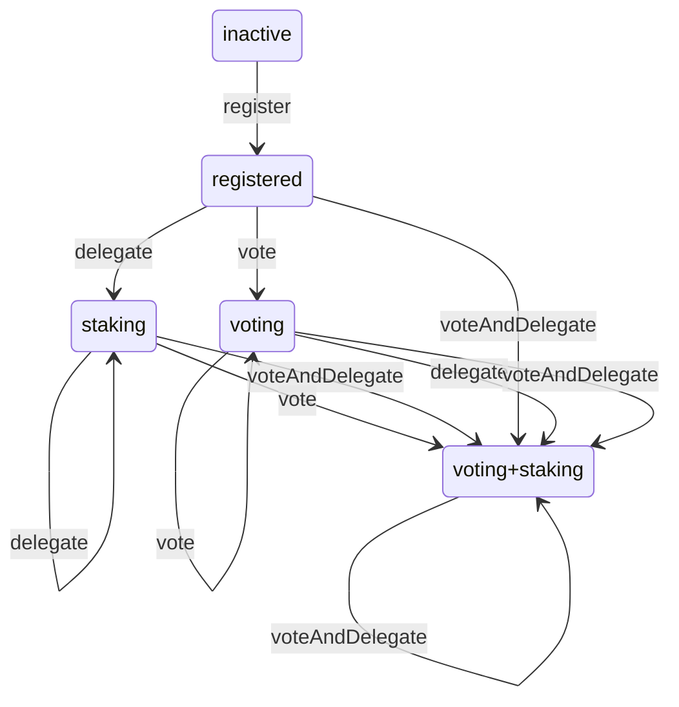
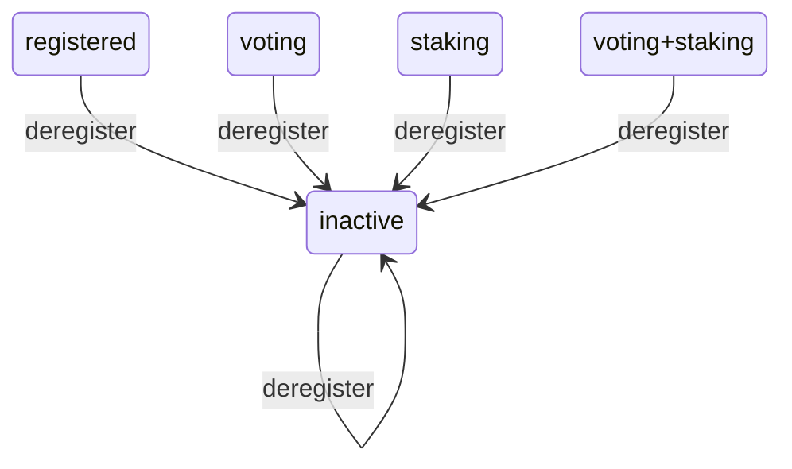

# Delegation History

# Synopsis

The `Delegations` type represents the history of the delegation and voting status.

A user can

* delegate their funds to a stake pool ("**staking**") in order to earn rewards from **block production**.
* delegate their **voting** power (one ADA = one vote) to a decentralized representative (DRep) in order to participate in **governance**.

These two statuses are coupled: A user who delegates funds to a stake pool, but does not delegate their voting power to a DRep, will not be able to withdraw the rewards earned from delegation. This restriction is meant to incentivize user participation in governance.

Voting is the defining new feature of the Conway era, specified in [CIP-1694][cip-1694].


The delegation and voting status can be changed by sending **delegation certificates** to the blockchain. In the Cardano ledger specification, these certificates are handled by the DCERT rule.

The precise binary format of the certificate is still somewhat in flux; some certificates are combinations of others.

In order to delegate user funds and participate in voting, one possibility is to use the following sequence of steps:

1. The wallet creates a reward address, that is a public/private key pair.
2. The wallet sends a certificate `stake_vote_reg_deleg_cert` to the blockchain. This will do several things at once:

    * Register the reward address as reward account. This requires paying a **deposit**.
    * Specify a stake pool to which the reward account should be delegated.
    * Specify a DRep to which the voting power should be delegated.

Sometimes, the wallet submits a sequence of certificates to the blockchain. This sequence can be included in a single transaction, or it can be spread out over several transactions or blocks.
Here, the `Delegations` type only keeps track of the final change to the delegation status in each block, as only this change is relevant when rolling blocks forwards or backward.

For more details, see also
* [Shelley ledger specification, Section 9 "Delegation"][shelley-spec] for details on delegation to stake pools
* [CIP-1694][] for details on the voting system
* [Conway ledger specification, Section 13 "Delegation"][conway-spec] for the DCert rule in the Conway era.

  [shelley-spec]: https://github.com/IntersectMBO/cardano-ledger/releases/latest/download/shelley-ledger.pdf
  [conway-spec]: https://intersectmbo.github.io/formal-ledger-specifications/pdfs/cardano-ledger.pdf
  [CIP-1694]: https://github.com/cardano-foundation/CIPs/tree/master/CIP-1694

# Data type

## Delegation status

The possible delegation statuses are:

1. _inactive_ : the funds are not associated with a reward account
2. _registered_ : the reward account is active, but no pool or DRep has been specified
3. _staking_ : the reward account is staking to a pool
4. _voting_ : the reward account is delegating voting power to a DRep
5. _voting+staking_ : the reward account is both delegating voting power to a DRep and staking to a pool.

In Haskell, we group the four active statuses into a single constructor for clarity:

```hs
data Status drep pool
    = Inactive
    | Active (Maybe drep) (Maybe pool)
```

The key difference between `Inactive` and `Active` is a **deposit**. This deposit needs to be paid for a transition `Inactive` → `Active`, and will be returned for a transition `Active` → `Inactive`. The purpose of the deposit is to prevent spamming the ledger state with reward accounts.

## Observation

1. _delegation status at a slot_, `status x xs`: For any slot `x` in the past or future, we can ask the history `xs` for the delegation status at this slot. In other words, the `Delegations` type represents a full timeline. The delegation status is the one obtained _after_ applying the block (if present) at the given slot.

Pictorially:
```
History of delegations

              Status
   …
   voting+staking drep1 pool2 |                     ***
   voting+staking drep1 pool1 |                 ****   ***
   staking pool2              |          **  ***
   staking pool1              |        **  **
   registered                 |     ***
   inactive                   |*****
                               —————————————————————————————> Slot
```

## Status transitions

Each delegation certificate that is sent to the blockchain can induce a status transition. The possible transitions are:

1. _deregister_ : remove the reward account
1. _register_ : register a reward account
2. _delegate_ : delegate stake to a stake pool identifier
3. _vote_ : delegate voting power to a rep
4. _delegateAndVote_ : simultaneously delegate stake to a stake pool identifier and delegate voting power to a rep

The following diagrams shows the last four transitions, which move the status to an active status. Note that _voting_ and _staking_ are "sticky": Once the wallet is delegating to a stake pool, or delegating its voting power, the only way to undo this status is to _deregister_ the reward account.



The effect of the _deregister_ transition is shown in the following diagram:



In Haskell, we group the four active transitions into a single constructor `VoteAndDelegate` for clarity.

We note that because multiple certificates can be included in a single transaction or block, the delegation status recorded in the `Delegations` history can jump over several transitions from one slot to the next.

## Operations

Operations on the `Delegations` type change the timeline. Operations are associated with a slot: Each operation sets the future of the timeline from that slot on (and including that slot) to a constant value.

1. _deregister from slot_ : Rewrite the future to have status _deregistered_ from that slot on.
2. _vote and delegate_ : Rewrite the future to have the corresponding active status from that slot on — _registered_, _staking_, _voting_, or _voting+staking_ as the case may be.
3. _rollback to slot_ : Rewrite the future to have the same status as the one at the given slot, from that slot on.

Operations do nothing if the change from the current status to the new status at this slot is not one of the status transitions above.

In Haskell, the operations are defined as

```hs
data Operation slot drep pool
    = VoteAndDelegate (Maybe drep) (Maybe pool) slot
    | Deregister slot
    | Rollback slot
```