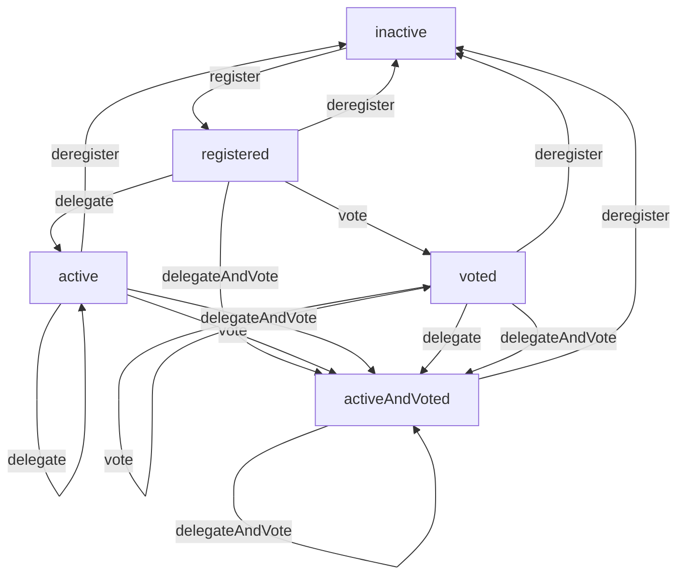

# Delegation History

# Synopsis

The `Delegations` type represents the history of the delegation status.

User funds are delegated by sending a sequence of four delegation certificates to the blockchain:
1. _stake key registration certificate_ : The wallet creates a reward address, that is a public/private key pair. Then, it registers this address as a reward account on the blockchain via this certificate.
2. _delegation to a pool certificate_ : The wallet specifies a stake pool to which the reward account should be delegated to via this certificate.
3. _vote certificate _ : The wallet cast abstain or no confidence vote or specifies a decentralized representative to which the vote is casted.
4. _delegation to a pool and vote certificate_ : The wallet does point 2 and 3 together.
The last two delegation certificates are only valid Conway onwards ([CIP -1694][cip1694].

  [cip1694]: https://github.com/cardano-foundation/CIPs/tree/master/CIP-1694

This sequence of certificates can be included in a single transaction, or it can be spread out over several transactions or blocks.
Here, the `Delegations` type only keeps track of the final change to the delegation status in each block, as only this change is relevant when rolling blocks forwards or backward.

See the [Shelley ledger specification, Section 9 "Delegation"][ledger-spec] for more details.

  [ledger-spec]: https://github.com/IntersectMBO/cardano-ledger/releases/latest/download/shelley-ledger.pdf

# Data type

## Delegation status

1. _inactive_ : staking is false and no pool identifier present
2. _registered_ : staking is true and no pool identifier present
3. _active_ : staking is true and pool identifier present
4. _voted_ : voting is true, staking is true and no pool identifier present
5. _activeAndVoted_ : voting is true, staking is true and pool identifier present

## Observation

1. _delegation status at a slot_, `status x xs`: For any slot `x` in the past or future, we can ask the history `xs` for the delegation status at this slot. In other words, the `Delegations` type represents a full timeline. The delegation status is the one obtained _after_ applying the block (if present) at the given slot.

Pictorially:
```
History of delegations

              Status
   …
   active pool1 and voted |                     ***
   active pool2 and voted |                 ****   ***
   active pool2           |          **  ***
   active pool1           |        **  **
   registered             |     ***
   inactive               |*****
                          —————————————————————————————> Slot
```

## Status transitions

Each delegation certificate that is sent to the blockchain can induce a status transition:



1. _register/deregister_ : signal the presence / absence of any staking key
2. _delegate_ : signal the choice of a specific pool identifier
3. _vote_ : signal casting of a vote
4. _delegateAndVote_ : signal the choice of a specific pool identifier plus casting a vote

We note that because multiple certificates can be included in a single transaction or block, the delegation status recorded in the `Delegations` history can jump over several transitions from one slot to the next.

## Operations
Operations on the `Delegations` type change the timeline. Operations are associated with a slot: Each operation sets the future of the timeline from that slot on (and including that slot) to a constant value.

1. _register from slot_ : Rewrite the future to have status _registered_ from that slot on.
1. _deregister from slot_ : Rewrite the future to have status _deregistered_ from that slot on.
2. _delegate to pool from slot_ : Rewrite the future to have status _active_ from that slot on.
3. _cast a vote from slot_ : Rewrite the future to have status _voted_ from that slot on.
4. _delegate to pool and cast a vote from slot_ : Rewrite the future to have status _activeAndVoted_ from that slot on.
5. _rollback to slot_ : Rewrite the future to have the same status as the one at the given slot, from that slot on.

Operations do nothing if the change from the current status to the new status at this slot is not one of the status transitions above.
