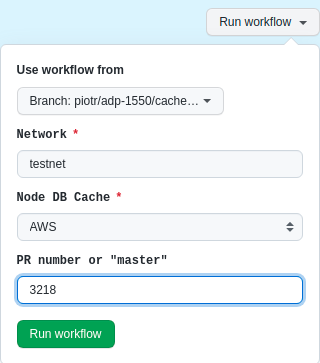

# E2E testing

E2E functional tests of cardano-wallet are running nightly on [cardano preprod testnet](https://book.world.dev.cardano.org/environments.html). Running tests against public testnet allows to exercise cardano-wallet on environment close to production (mainnet) utilizing and integrating maximally all components of the Cardano ecosystem like Stake pools, SMASH, metadata token server etc.


## Running tests

In order to run tests one needs to [have ruby](https://www.ruby-lang.org/en/documentation/installation/) (at least 3.1.2).

### Configuring test project
1. Get necessary _gems_.
```bash
cd test/e2e
bundle install
```
2. Decrypt secret files using `$TESTS_E2E_FIXTURES` secret:
  - `fixture_wallets.json.gpg` containing mnemonics of testnet fixture wallets

```bash
export TESTS_E2E_FIXTURES=*******
rake secrets_decode
```
> :information_source:  **_TESTS_E2E_FIXTURES_** secret  is defined on https://github.com/cardano-foundation/cardano-wallet/settings/secrets and also used by GH actions. Note that this step is also executed on very first test run.
> :information_source:  **_TESTS_E2E_FIXTURES_** is also kept in the team's Vaultwarden.

#### Fixture wallets
The command `rake secrets_decode` can be used to decode the file [fixture_wallets.json.gpg](https://github.com/cardano-foundation/cardano-wallet/blob/master/test/e2e/fixtures/fixture_wallets.json.gpg) into a plain JSON file named `fixture_wallets.json`. This file contains mnemonic sentences of the wallets that are utilized in tests. The test framework will retrieve these wallets from the file. It is important to note that there are separate sets of wallets for different operating systems, namely Linux, MacOS, and Windows. This allows tests to be run in parallel on different operating systems.

#### Fixture wallets update
If there is a need to update the mnemonics to new ones, it is certainly possible. After making the updates, remember to use the `rake secrets_encode` command to encode the updated plain JSON file into a GPG-encoded file. The updated GPG file then needs to be pushed to the repository so that it can be used by the continuous integration (CI) system.

> :information_source: There is a utility command `rake fixture_wallets_template` which generates the file `fixture_wallets.json`  from scratch with new mnemonic sentences.

Please note that the wallets used in tests must have ADA and specific assets on their balance. Test ADA can be obtained from the [Faucet](https://docs.cardano.org/cardano-testnet/tools/faucet/). The assets required on the wallet's balance are:

-   SadCoin (with [metadata](https://metadata.world.dev.cardano.org/metadata/ee1ce9d7560f48a4ba3867037dbec2d8fed776d94dd6b00a35309073))
-   HappyCoin (with [metadata](https://metadata.world.dev.cardano.org/metadata/919e8a1922aaa764b1d66407c6f62244e77081215f385b60a62091494861707079436f696e))

Both assets have metadata in the [Testnet Metadata Registry](https://github.com/input-output-hk/metadata-registry-testnet), and there are tests in place to ensure that the wallet reads data from there correctly. Both assets can be minted outside of the wallet using tools such as `cardano-cli` or [token-minter](https://github.com/piotr-iohk/token_minter), and then sent to the balances of the fixture wallets. Policy scripts and keys required for minting are availeble in [tests/e2e/fixtuers/wallet_assets](https://github.com/cardano-foundation/cardano-wallet/tree/master/test/e2e/fixtures/wallet_assets).

#### Further test setup
There may be certain tests that require additional actions to be performed before they can be successfully executed. In such cases, the test will fail and display an appropriate message with instructions. An example of such a test is `AlwaysFails.plutus with collateral return to the wallet`, which requires a specific UTXO to be set up on the testnet where the test will be executed. This setup is a one-time operation and is only necessary when running tests on a new testnet or when the existing testnet has been reset. The scenario is accompanied by detailed comments and step-by-step instructions on how to proceed. If the required actions have not been taken, the test will fail and display the appropriate message.

### Running all tests
In order to run all `e2e` tests one can simply run single [rake](https://github.com/ruby/rake) task:
```bash
$ rake run_on[preprod]
```
This master task is performing also all the necessary configuration steps (i.e. getting latest testnet configs and wallet/node binaries from [Cardano Book](https://book.world.dev.cardano.org/environments.html), starting everything up). All steps can also be executed as separate tasks , i.e.:

```bash
$ rake secrets_decode
$ rake get_latest_bins
$ rake get_latest_configs[preprod]
$ rake start_node_and_wallet[preprod]
$ rake wait_until_node_synced
$ rake spec
$ rake stop_node_and_wallet[preprod]
```
> :information_source:  **_Linux / MacOS_**
cardano-node and cardano-wallet are started as separate [screen](https://www.gnu.org/software/screen/manual/screen.html) sessions. One can attach to the respective session using:
>```bash
>$ screen -r NODE_preprod
>$ screen -r WALLET_preprod
>```

> :information_source: **_Windows_**
cardano-node and cardano-wallet are started as separate Windows services using [nssm](https://nssm.cc/) tool. One can examine services using Windows service manager like `services.msc`.

> :information_source: **_Docker_**
One can also start tests against cardano-wallet docker. There is docker-compose-test.yml provided that includes cardano-node and cardano-wallet. To start it several env variables need to be set to feed docker-compose:
>```bash
>NETWORK=preprod \
>TESTS_E2E_TOKEN_METADATA=https://metadata.world.dev.cardano.org/ \
>WALLET=dev-master \
>NODE=8.1.1 \
>NODE_CONFIG_PATH=`pwd`/state/configs/$NETWORK \
>DATA=`pwd`/state/node_db/$NETWORK
>docker-compose -f docker-compose-test.yml up
>```
> Then running tests against docker is just:
>```bash
>$ rake wait_until_node_synced
>$ rake spec
>```

#### Running tests against local wallet
One can also run tests against `cardano-wallet` and `cardano-node` which are specified on machine's `$PATH`:

```bash
$ TESTS_E2E_BINDIR="" rake run_on[testnet]
```
Running tests as such skips downloading latest wallet and node binaries.

### Test artifacts

By default following locations are used for different artifacts used by the tests:
- `./bins` - location for wallet and node binaries (will be downloaded here from [Buildkite](https://buildkite.com/cardano-foundation/cardano-wallet))
- `./state` - wallet/node databases, logs and configs

Locations are relative to `test/e2e` directory.
Default values can be changed by providing environment variables, for instance:

```bash
TESTS_E2E_STATEDIR=~/state \
TESTS_E2E_BINDIR=~/bins \
rake run_on[preprod]
```
Full list of environment variables is available in `e2e/env.rb`.

### Running specific tests
There are two types of tests within the suite:
 - `e2e` - tests that require node and wallet to be synced with the network (i.e. `rake wait_until_node_synced` step needs to pass before running them)
 - `non-e2e` - tests do not require node to be fully synced

One can run specific tests using by providing `SPEC` or `SPEC_OPTS` arguments to the rake task. For example:

 - run all tests (by default it'll download binaries from Hydra and wait for node to be synced before starting tests)
 ```ruby
 $ rake run_on[preprod]
 ```
 - run only `e2e` tests
 ```ruby
 $ rake run_on[preprod] SPEC_OPTS="-t e2e"
 ```
  - run only `non-e2e` tests on downloaded binaries and don't wait for node to be synced
 ```ruby
 $ rake run_on[preprod,bins,no-sync] SPEC_OPTS="-t ~e2e"
 ```
  - run only tests matching specific string
 ```ruby
 $ rake run_on[preprod] SPEC_OPTS="-e 'CardanoWallet::Shelley::Wallets'"
 ```
  - run only specific test identified by line of test code against node and wallet from the `$PATH` (skips downloading from Hydra)
 ```ruby
 $ TESTS_E2E_BINDIR="" rake run_on[preprod] SPEC=spec/shelley_spec.rb:9
 ```

>:information_source: Tests can be also executed using `rspec`.

### Skipping / making test pending

When test is failing due to a bug it can be marked as `pending`. This mark expects test to fail. When such test actually passes the report will indicate such test as failure indicating that it can be turned on again.

```ruby
it "Wallet can make multi-address transaction" do
  pending "ADP-777 - Failures on multi-address transactions"
  ...
end
```

Test can be also skipped, so it is not executed at all.

```ruby
it "Wallet can show utxo distribution" do
  skip "This functionality works intermittently - to be investigated"
  ...
end
```

### Running tests from GH actions workflow

There are several e2e workflows in GH actions for testing against different platforms (Docker, Linux, MacOS, Windows).

#### Node DB cache

For speeding up execution in wallet's full mode we use cardano-node DB from cache. Thanks to this we don't have to wait for hours on each execution until cardano-node is synced with the chain. On CI it is handled by [actions/cache](https://github.com/actions/cache).

#### Test schedule

All tests are scheduled to be executed on nightly basis against latest `master` version
of cardano-wallet.

It is also possible to trigger each workflow manually from [GH actions](https://github.com/cardano-foundation/cardano-wallet/actions). In particular:
 - workflows can be executed against the binaries of particular PR,
 - for full wallet mode one can choose whether to use Node DB cached from GH cache or AWS



## Documentation

Cardano-wallet-rb repository: https://github.com/piotr-iohk/cardano-wallet-rb.

Ruby doc: https://piotr-iohk.github.io/cardano-wallet-rb/master/.
